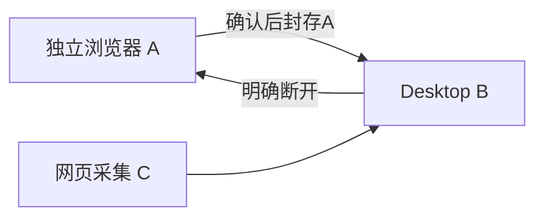

<div align="center">
  <picture>
    <source media="(prefers-color-scheme: dark)" srcset="public/assets/brand/logo-dark.png">
    
  </picture>

  <h1>LexiMeet Browser</h1>
  <p>在阅读中遇见单词，把真实语境留成记忆。</p>
  <p><strong>本地优先 · 六种练习 · 可连接桌面端</strong></p>

[快速开始](#快速开始) · [使用指南](docs/用户指南.md) · [图文演示](docs/实操演示.md) · [文档](docs/README.md) · [贡献](CONTRIBUTING.md)

</div>

---

词遇浏览器插件是一款 Chromium MV3 扩展。独立使用时，可以管理单词和笔记、设置学习规划并练习；连接 Desktop 后，可以在网页查看桌面词卡，采集的内容直接存入桌面端。原有独立资料会封存，明确断开连接后即可恢复。

当前版本为 **1.0.0**。支持独立学习和本机桌面连接；账号与云同步列入后续路线。发布物、目标平台与验收范围以对应版本的发行说明为准。[测试与验收](docs/测试与验收.md)

<picture>
  <source media="(prefers-color-scheme: dark)" srcset="docs/assets/usage-reading-workspace-dark.png">
  
</picture>

阅读图由真实无头会话中的正文和原生侧栏截图并排展示，不含浏览器工具栏。[按步骤操作](docs/实操演示.md)

| 阅读                           | 学习                                       | 数据由你掌握                    |
| ------------------------------ | ------------------------------------------ | ------------------------------- |
| 即时词卡、原生侧栏、悬浮球拖词 | 列表、选义、临摹、默写、听音、填空         | 个人资料本地保存                |
| 保留真实单句和精确词位         | 默认10词新学/20词复习，积分与FSRS分层      | 默认脱敏、七天同语境去重        |
| Lite内置，Core增量可选         | 同范围各练法独立进度、草稿可恢复、随时重开 | 连接不上传/合并独立库，失联停写 |

源码与协作：[GitHub](https://github.com/leximeet/leximeet-browser) · [Gitee](https://gitee.com/leximeet/leximeet-browser)。两个平台平级；下载时请核对对应版本的发行说明与校验文件。

## 快速开始

需要 Node.js 22.12+ 和 Chrome/Chromium 142+。下列命令会启动独立的可见验收浏览器，不影响日常使用的 Chrome：

```sh
npm ci
npx playwright install chromium
npm run lab:browser
```

首次启动会打开包内教学，并另开 Node.js 英文文档；外网访问失败时，会改用本地示例文章。关闭浏览器或按 Ctrl+C 会清理本轮资料。若只使用本地页：`LEXIMEET_LAB_URL=local npm run lab:browser`。

长期使用时，可运行`npm run build`，在 Chrome 扩展管理页加载`.output/chrome-mv3/`；Edge 使用`npm run build:edge`和`.output/edge-mv3/`。资料会保存在你自己的浏览器中。临时 lab 的资料会在退出时清理，请勿用它长期保存资料。

## 连接Desktop

两端提供发现通知，可从任一端发起连接，并在**浏览器确认窗接受**。随后，网页遇见和采集会使用 Desktop 资料。无需手动输入配对码；临时掉线时暂停写入，明确断开后恢复原有独立资料。

<!-- leximeet-diagram: figure-b335630551-01 -->
<picture>
  <source media="(prefers-color-scheme: dark)" srcset="docs/diagrams/rendered/figure-b335630551-01.dark.svg">
  
</picture>

<details>
<summary>查看和编辑 Mermaid 源码</summary>

[图源文件](docs/diagrams/figure-b335630551-01.mmd)



</details>
<!-- /leximeet-diagram -->

推荐在 Desktop 仓库运行`bash scripts/test-desktop.sh --connected`，一键准备隔离运行环境；源码联调使用`npm run lab:connected`。详见[开发指南](docs/开发指南.md#双端环境)与[连接设计](docs/桌面连接.md)。

## 开发与验证

```sh
npm run format:check
npm run verify          # 类型、单元、构建、清单及完整无头独立UI
npm run test:connected  # 真实Native / Desktop / Core
npm run zip            # 生成本地 Chrome ZIP
npm run zip:edge       # 生成本地 Edge ZIP
npm run verify:store-packages # 核验两份 ZIP 和同一生产字节
```

所有自动回归均使用独占 profile，默认无界面，不操作系统键鼠，也不重试。协议、词包、共享向量和依赖均已锁定。模型、源码 UI、应用包、系统横幅和远端 Actions 的验证范围各不相同，不能相互替代。[测试设计](docs/测试与验收.md) · [发布清单](docs/发布指南.md)

## 文档与参与

[功能设计](docs/功能设计.md) · [学习规则](docs/学习与复习.md) · [架构与数据](docs/架构与数据.md) · [隐私和权限](docs/隐私与权限.md) · [UI与交互](docs/UI与交互.md) · [路线图](docs/路线图.md)

报告问题时，请附上复现步骤、浏览器和操作系统版本，以及清理过的截图；安全问题通过[私密报告](SECURITY.md)提交。项目遵循[行为准则](CODE_OF_CONDUCT.md)。

## 许可与致谢

代码采用[AGPL-3.0-only](LICENSE)。内置 Dictionary 0.0.3 Lite Text（26,417 词），安装 Core 增量后共 117,902 词；公共数据遵守包内各自许可，不含离线音频。默认有道发音只发送公开词头，也可设置自定义的公开 HTTPS 发音；微软 Provider 尚未接入。

感谢 LexiMeet Dictionary 及其数据来源、Tabler、Vue、WXT、fzstd、Playwright 和 FSRS 作者，也感谢 Read Frog、AIPex、Chrome Extensions Samples、Aictionary 和 qwerty-learner 提供的参考。完整声明见[第三方与许可](docs/第三方与许可.md)。

## 正式下载

[1.0.0 Release](https://github.com/leximeet/leximeet-browser/releases/tag/1.0.0)提供 Chrome 与 Edge ZIP、完整对应源码和校验文件。安装步骤、商店与验证边界见[本版说明](docs/版本/1.0.0.md)。
