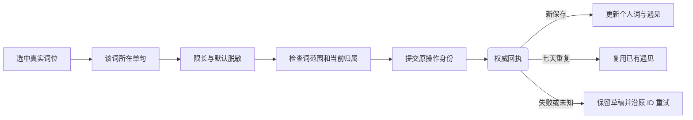
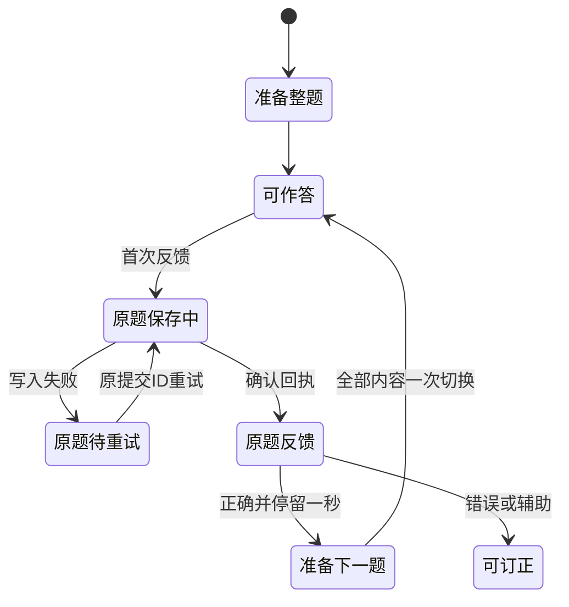

# 功能设计

词遇把阅读中遇见的英文词和真实语境留到个人词库，再通过练习形成学习状态。用户可以只记录单词，也可以开启学习规划；学习规划不是使用词库的门槛。

本文说明当前功能怎样衔接、谁负责数据和失败时怎样继续。[用户指南](用户指南.md)提供实际截图，[架构与数据](架构与数据.md)提供源码边界。

## 两种使用形态

| 功能                             | 独立使用                        | 连接 Desktop                             |
| -------------------------------- | ------------------------------- | ---------------------------------------- |
| 正文遇见与即时词卡               | 本地词库/目标匹配，本地公共词典 | Desktop 匹配与权威词卡                   |
| 点词、拖球和侧栏采集             | 写插件个人库                    | 写 Desktop，成功后桌面通知由桌面设置控制 |
| 批注、单词本选择                 | 本地当前资料                    | 当前 Desktop 的授权资料                  |
| 学习规划、六种练习、笔记和回收站 | 插件管理页                      | 提示前往 Desktop                         |
| 连接设置                         | 发现、发起、确认                | 明确断开                                 |
| 系统快速练习提醒                 | 未实现                          | Desktop 负责                             |
| 登录和云同步                     | 尚未实现，列入 2.0              | 不借用 Desktop 的云凭据                  |

连接不会合并两库。确认前封存独立 A，网页改用桌面 B；临时失联时暂停，明确断开后才恢复 A。连接期间，采集不会悄悄写入 A。界面虽然可以切换后端，私人资料的归属仍必须明确。

## 从安装到日常学习

<!-- leximeet-diagram: figure-93a1929f6a-01 -->
<picture>
  <source media="(prefers-color-scheme: dark)" srcset="diagrams/rendered/figure-93a1929f6a-01.dark.svg">
  
</picture>

查看和编辑 Mermaid 源码

[图源文件](diagrams/figure-93a1929f6a-01.mmd)

<!-- /leximeet-diagram -->

首次安装会打开包内教学，展示真实侧栏、词卡和采集流程。用户可从设置重新进入教学，不会清空用户资料；跳过后，仍可从浮球、侧栏或管理页开始使用。

### 学习规划是一次完整提交

规划弹窗分两步：选择公共词书或整本当前词典，再设置每天新学和复习。默认新学 10、复习 20。点击最后的保存后，目标与配额才一起生效；第一步选词书时，不会立即改变队列。

设置规划后，今日任务综合已有遇见、继续学习、目标补充词和到期复习。调整配额保留当前计划；更换目标建立新计划，已经开始的单词、笔记、语境和练习事件保留。暂停计划停止补充目标新词，不阻止继续练习已有资料。

规划面板展示当前目标四种状态、初学完成率、近14天真实作答词数和未来7天已知到期词数；比较不同每日新学额度的完成日与候选顺序，预览不保存计划。重复作答按词和自然日去重，揭晓不冒充作答；已知复习仅采用活动词当前排程，逾期归今天，不模拟未来FSRS。回收词退出目标与候选，历史真实作答保留。暂停停止额度推演，真实历史和已知复习仍可查看。

插件目前没有系统学习提醒设置；Desktop 的时间范围和快速练习通知属于桌面能力。不能在插件中展示一个不执行的提醒开关。

### 我的词库和遇见记录分工

我的词库按单词组织：全部、未学习、学习中、待复习、已熟悉、不熟悉筛选，支持检索公共释义与个人笔记、主词性/资料来源筛选、多个单词本与分页多选。个人编辑只包含笔记和单词本，不覆盖公共释义。批量加入和回收用一个事务校验所有版本；任一冲突整批拒绝。回收词不被公共目标重新补回，恢复保留原学习事实。遇见记录按“这次在何处读到”的事实组织，展示较小的单句语境、来源和时间。同词可以有多条不同语境，查看或编辑词不等于新增遇见。

0 分“不熟悉”是独立筛选，可以与学习中/待复习重叠；主状态依据学习经历和休息周期，不是简单把分数分成四段。加入目标词库也不会自动变成“已学习”。

## 阅读与采集

### 遇见：找已有词，不重复占行

点击浮球或打开侧栏进入遇见，匹配当前页的个人词和学习目标。正文保留真实 Range 高亮，悬停立即显示公开词卡；私人历史只在可信扩展界面展示。

侧栏按大小写归一词头显示一词一行，例如 `Node` 三处是一行，`The/the` 是一行。原始三处位置仍保留，用户选另一处时词卡和当前语境跟随该位置。行数不是页面出现次数，也不是已存遇见次数。

### 三个网页采集入口复用同一流程

- 侧栏进入采集后点正文词，确认所选语境，点击加入。
- 拖动悬浮球变成采集篮，在真实词位松手。
- 当前词卡入口选择单词本并确认保存。

三个入口都提交所选位置的同一类草稿，由后台确认归属、完成安全处理并执行权威写入。每个入口都必须真正保存事实，不能只改变按钮文字。连接模式以 Desktop 的 WordRef 为准；同拼写多个条目要求明确选择，不把 Lite 本地词 ID 替换到桌面请求中。

<!-- leximeet-diagram: figure-93a1929f6a-02 -->
<picture>
  <source media="(prefers-color-scheme: dark)" srcset="diagrams/rendered/figure-93a1929f6a-02.dark.svg">
  
</picture>

查看和编辑 Mermaid 源码

[图源文件](diagrams/figure-93a1929f6a-02.mmd)

<!-- /leximeet-diagram -->

默认最长 500 个 UTF-16 单元、默认脱敏、默认七天去重，可在设置调整。脱敏把邮箱、手机号、令牌等命中的敏感片段替换为 `xxx`，同时重新计算真实词位；它是有限规则检测，不能保证任何敏感信息都能识别。保存前可查看安全后的句子。[隐私与权限](隐私与权限.md)

去重比较同词和规范安全语境：NFC、空白和大小写归一；原文大小写和位置仍保留。例如七天内重复采集 `Node uses the system.` 与 `node uses the system.` 复用同一遇见；`Node improves the system.` 是新语境。不同句子的同词不会被全局删除。

### 切页、收栏和失败

采集会话绑定原 tab、文档和代次。正常网页导航、SPA 文档变化后旧位置失效，不能把旧句子存到新页。词遇跳转前询问草稿；浏览器原生关闭侧栏不能拦截，释放交互锁并保留未加入草稿。返回时只允许原来源继续。

失联、授权或租约到期时撤下私人投影，保留原操作的待回执；不把“查不到”当“未收录”并新建另一词。界面只有真实保存回执才能展示采集成功。

## 练习中心：一题、一次首次反馈、完整换题

六种方式固定顺序，范围固定，各模式有自己的词游标、完成进度和输入草稿：

| 顺序与模式 | 核心交互                                | 首次独立正确 |
| ---------- | --------------------------------------- | ------------ |
| 1 单词列表 | 默认遮中文，可切遮英文；熟悉/不熟悉反馈 | +1           |
| 2 看词选义 | 2–4 个真实短义，点击选项                | +1           |
| 3 单词临摹 | 低对比幽灵字符，当前字母光标，逐字输入  | +1           |
| 4 单词默写 | 隐藏词形，按释义逐字回忆                | +2           |
| 5 听音辨词 | 听真实词音，输入整词确认                | +1           |
| 6 语境填空 | 真实含词句子中的空缺，输入整词确认      | +2           |

真实短义不足时，不生成选义题；没有包含本词的真实句子时，不生成填空题。此时可以更换练法。干扰项筛掉符号、缩写、重复短义和已知重叠义，优先同词性并按词身份和范围位置确定性轮换，避免每题固定前三条。多义和近义仍需要抽审，筛查不等于语义完全无歧义。

### 点击后的状态机

<!-- leximeet-diagram: figure-93a1929f6a-03 -->
<picture>
  <source media="(prefers-color-scheme: dark)" srcset="diagrams/rendered/figure-93a1929f6a-03.dark.svg">
  
</picture>

查看和编辑 Mermaid 源码

[图源文件](diagrams/figure-93a1929f6a-03.mmd)

<!-- /leximeet-diagram -->

按下选项后，立即显示选中项和对错反馈；保存期间不淡化整张卡片，也不插入正常保存告警。落盘确认之后至少停留一秒，然后自动切下一题。当前词正在发音时先让声音完整结束；发音失败、停止或超时也会恢复推进，不让播放器卡住练习。准备下一题时保留上一题完整内容，词头、选项、游标一次切换，避免加载文字导致闪动和布局塌陷。

错误不自动跳过；订正会记录实际操作，但同一道题的首次反馈之后不再重复加分。快速连点和 Enter 连按不产生多次计分。题目身份绑定当前实际显示的冻结题，不用“当前词最新题”猜答案。

看词选义答错后保留原题与对错展示，选项继续锁定，由用户手动进入下一题；拼写与整词输入题可以订正，但同一题后续订正不再加分。

拼写出现错字 300ms 后重写本词；中间重复短暂反馈；完成最后一遍并保存确认后至少停留一秒；当前词发音尚未结束时继续保留原题。拼写设置可关闭自动下一词、调整 1–10 遍和音效；不要求每词额外点击一个确认页。声音、发音和视觉反馈分开，默认看词选义不朗读答案。

### 暂停、换方式和重新开始

打开拼写设置、词卡或范围弹窗，以及离开练习中心、切换方式或重新开始时，都会取消旧倒计时和迟到的题目准备。返回旧题不会突然跳词。落盘中或失败待重试时禁止推进、换方式和重开，避免绕过未知结果。

“重新开始”在练习范围右侧，产生新会话和新题，从第一词开始；保留当前练法。它清空本轮草稿和首次反馈锁，已经真实保存的学习事件与分数保留，不能当作撤销成绩。换范围时询问是否保存进度，同范围切方式不弹重复确认。切回一种练法恢复其位置，“上一个”回看原题，空白点击仅在答案已确认保存后继续；回看不重算同题分数。完成进度按各模式完整回执对词去重，不依赖当前显示草稿、正确率或游标；十个词作答完成后为100%，末词选义答错仍计完成。本轮跳过的词有补练入口。

## 积分、主状态与被动复习

积分从 10 开始，限制在 0–30。首次达到 20 完成初学，最早下一自然日获得复习资格；真正从低于 30 达到 30 才开始休息。72 小时保护后，每满 48 小时减 1，衰减到 20 释放休息；期间错误可提前打破保护。

FSRS 计算下一次自动回忆时间。主动提前练对可以加分，但未到期的已有排程不延后；临摹、提示和辅助完成不伪装成独立回忆。今日复习时间取 FSRS 到期与初学/休息释放的较晚者。

例：`system` 首次反馈前 10 分；临摹完成变 11，但没有 FSRS 回忆。经过练习到 20，明天以后可复习；再到 30 进入休息。今天主动再练与到期提醒是两种用途，不因列表状态已熟悉就删除原学习事件。完整边界和数字见[学习与复习](学习与复习.md)。

## 资料整理和体验设置

个人内容只有笔记和多个单词本关联，公共词典升级不会覆盖它们。词典释义只读；个人编辑不提供自定义释义、标签或手动熟悉状态。编辑弹窗带打开时的 revision：别处先修改时拒绝旧覆盖，保留输入，不静默丢草稿。回收时保留学习和遇见事实，恢复后可继续投影；不能为了演示教学而要求用户删除真实资料。

词卡先展示词头、音标、发音和短义，再按标签展开语境、完整释义和记录。助记文章采用安全 Markdown 渲染，不把 `###` 原文直接当标题显示，也不执行原文 HTML。明暗主题、字体与词卡布局保持可读；窄窗卡片内部滚动，不遮挡主操作。

教学步骤绑定实际目标和成功回执，设置讲解不要求改用户偏好。教学可跳过和重进；网页、侧栏、管理页只显示当前所在阶段，旧窗口不能继续推进。复杂站点、辅助技术及发行浏览器的范围见[路线图](路线图.md)。

## 功能改动的验收入口

| 改动 | 必须看的行为                                                                        |
| ---- | ----------------------------------------------------------------------------------- |
| 练习 | 当前题与判题 ID 一致；保存前不计时；无空选项/布局位移；错误留题；重开和离开无旧计时 |
| 捕获 | 三入口真落盘；同词同句七天去重；不同语境保留；敏感范围重映射；连接只写 Desktop      |
| 规划 | 两步一次保存；默认 10/20；配额范围；切目标保留已开始词和私人内容                    |
| 连接 | 用户确认；封存 A；租约/代次变化撤私人投影；未知回执原 ID 查证；明确断开恢复 A       |
| 数据 | 多表原子性、并发 revision、重启资料保留；资源损坏不删除私人事实                     |

自动化默认无头、不使用系统键鼠、剪贴板或修改机器日期。三阶段生命周期测试用隔离环境的注入时钟模拟七天和当前格式替换包，不冒称已经测试未来软件版本升级。[测试与验收](测试与验收.md)
