# 跟着示例完成一次阅读与学习

这篇演示从一篇英文文章开始，依次完成采集、记笔记、整理单词本和练习。先按[用户指南](用户指南.md#1-安装并认识界面)安装扩展；截图里的文章、笔记和单词本均为示例资料。

截图来自当前生产扩展的真实操作。阅读工作区图由**同次真实无头会话的正文和原生侧栏截图并排展示，不含浏览器工具栏**；两张原始截图和来源清单由演示测试一起生成。这里只展示操作，不把截图当作系统通知、真实音质或发行浏览器兼容性的证明。

## 1. 打开文章，看看遇见了哪些词

1. 打开一篇普通 HTTP/HTTPS 英文网页，点击工具栏的词遇图标或右键悬浮球打开侧栏。
2. 点击侧栏的“分析本页”，正文中的目标词和已有个人词会高亮。
3. 点击右侧列表的一行，查看该词的释义；把鼠标放到正文另一处高亮词上，可查看那一处的语境。
4. 同一个词在文章里出现多次，右侧仍只占一行。下面两个 `Node` 合并为一行，`The/the` 也按同一词显示。

此时只是阅读，还没有把这篇文章的语境存入个人资料。悬浮球单击可关闭遇见高亮；右键可收起侧栏。

## 2. 留下一句语境

以 `Node uses the system.` 为例：

1. 点击侧栏上方的“采集”。
2. 在正文中点击 `Node`。蓝框指出当前选词；侧栏显示单词、来源与句子草稿。
3. 核对右侧句子确实是想保存的那一句，选择单词本。
4. 点击“加入单词本”，等待保存结果，再去“遇见记录”查看。

也可从悬浮球拖到正文中的一个词，等蓝框圈定后松手；空白处松手或按 Esc 会取消。需要先核对句子和选择单词本时，使用上面的侧栏流程。

<a href="assets/usage-saved-workspace.png">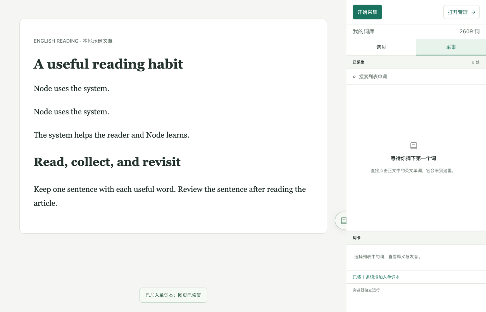</a>

再采集文章中相同的 `Node uses the system.`，默认七天内会返回重复结果，不增加遇见记录；`The system helps the reader and Node learns.` 是另一句，可以保存。不要把进入草稿视为已经保存，等待成功或重复提示后再离开。

## 3. 把单词整理到自己的单词本

1. 点击“打开管理”，进入“我的词库”。
2. 在左侧“我的单词本”旁点击加号，新建“技术用法”。
3. 搜索 `node`，点击结果，再点击“编辑个人内容”。
4. 在“我的笔记”里写下用法，勾选“技术用法”；可同时勾选多个单词本。
5. 点击“保存修改”。公共释义仍来自词典，个人编辑只维护笔记和单词本。

<a href="assets/usage-personal-note.png">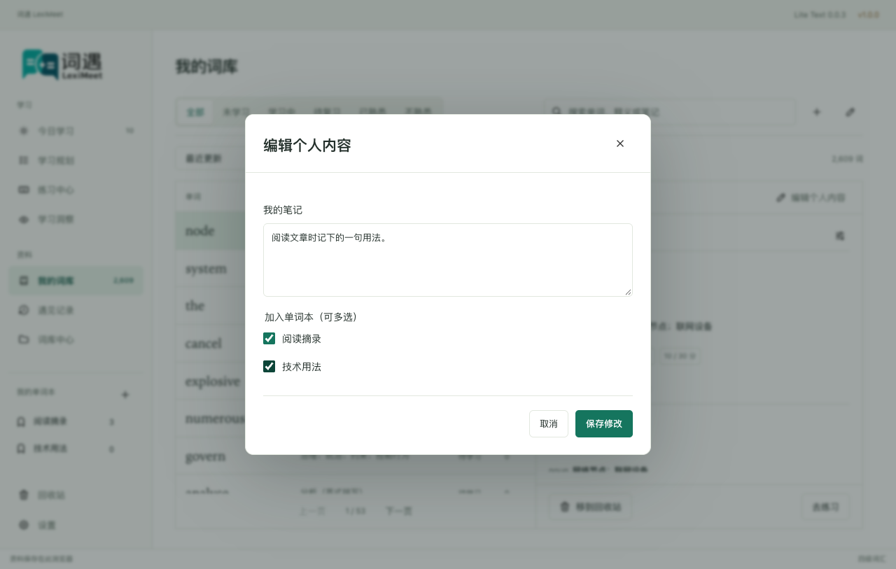</a>

需要批量整理时：

1. 点击词库搜索框旁的铅笔按钮，进入编辑模式。
2. 勾选几个词，点击“加入单词本”，勾选要加入的单词本并保存。
3. 翻页可继续选择；更换词性、来源或状态筛选会清除选择。点击完成图标结束编辑。

<a href="assets/usage-library-bulk.png">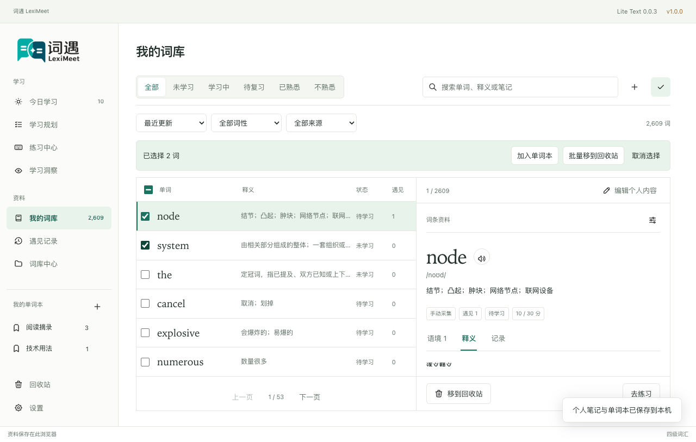</a>

“最近更新”旁可按主词性和资料来源筛选。词性来自当前词包，不对缺少词典资料的词猜测词性。

## 4. 不需要的词先移到回收站

1. 选中一个词，点击词卡底部的“移到回收站”；多选时点击“批量移到回收站”。
2. 确认窗口列出数量和词头。核对后点击“确认移到回收站”；点“取消”则保持原样。
3. 回收后，词不再出现在活动词库、学习候选和练习里。
4. 误操作时进入“回收站”，点击对应词的“恢复词条”。原笔记和学习记录保留。

<a href="assets/usage-recycle-confirmation.png">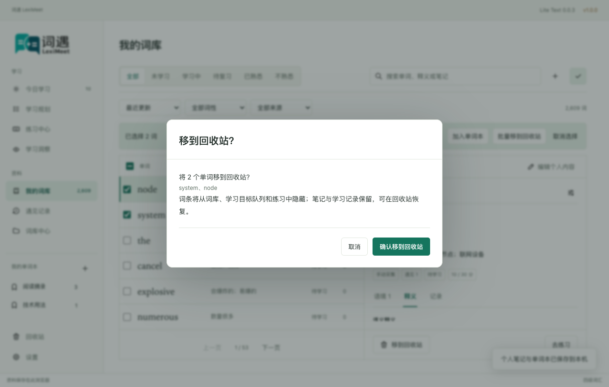</a>

## 5. 安排学习目标与每天的数量

1. 进入“学习规划”，点击“设置学习规划”。
2. 第一步选择词书，例如“四级词汇”，点击“下一步：每天学多少”。
3. 第二步设置每日新学和复习，默认分别为 **10** 和 **20**。
4. 点击“保存学习规划”，目标和每天数量一起生效。
5. 回到规划面板，查看目标状态、实际作答、已有复习安排和不同新学量的预计完成日期。

额度比较只做预览；确认采用另一额度时，点击“调整计划”并保存。面板不会承诺未来每天一定出现多少复习，也不会预测将来一定记住多少词。浏览器独立使用没有系统学习提醒；连接桌面端后由桌面端设置。

## 6. 六种练习各做一次

进入“练习中心”，先选择“我的词库”或“今日学习”。下面各方式共用所选词范围，**位置、草稿和完成数各自保存**：临摹练到第三词，再切听力练到第五词，切回临摹仍从第三词继续。

### 单词列表：先回想，再反馈

中文默认遮住。先回想释义，再点击“熟悉 +1”或“不熟悉 −1”；需要核对时点击遮挡内容查看答案。查看答案会记为辅助，不再把同题后续完成算作独立正确。

<a href="assets/usage-practice-list.png">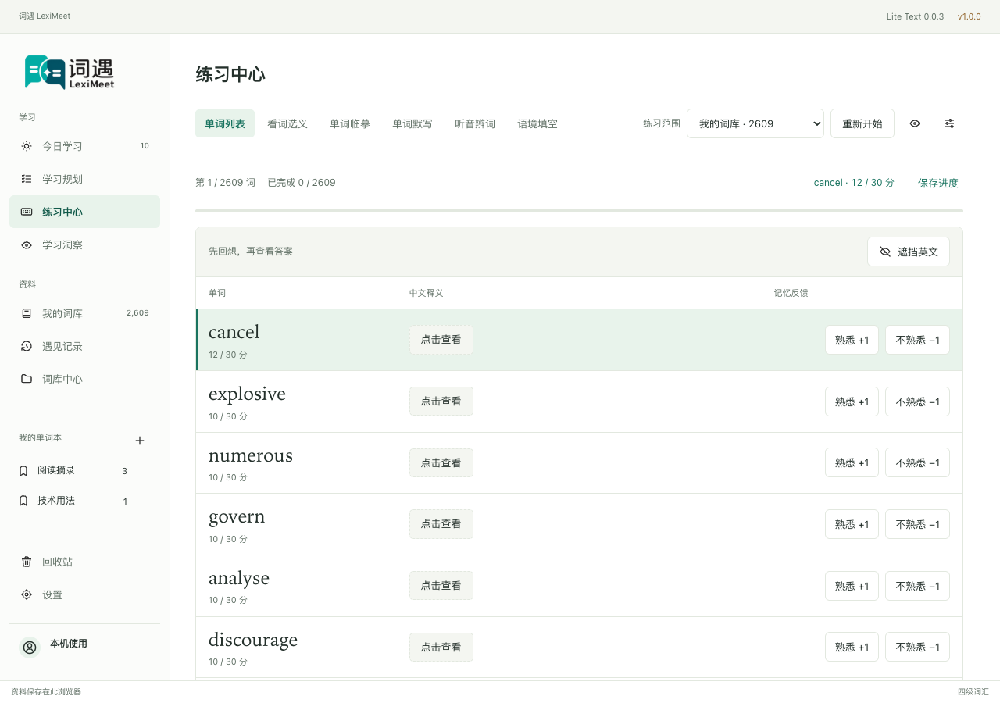</a>

### 看词选义：选择一项

点击与词头对应的释义。保存成功后，正确反馈至少停留 **1 秒**再自动下一词；错误留在当前题。回看或订正同题不会再次加分。

<a href="assets/choice-feedback-light.png">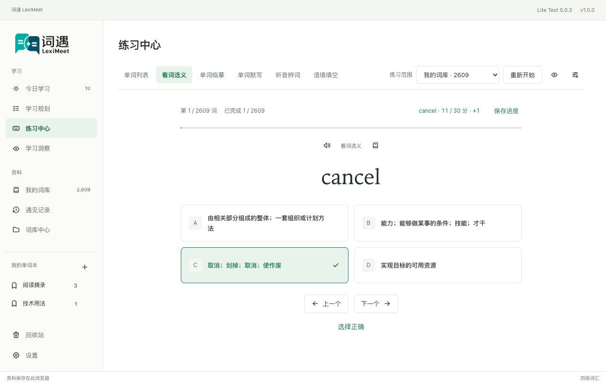</a>

### 临摹与默写：在练习输入框里逐字输入

临摹按淡色字符提示输入；默写回忆拼写，尚未输入的位置不显示答案。点击练习区即可聚焦输入，不需要点击每个字符。完成最后一遍才结算；临摹首次正确 **+1**，默写首次独立正确 **+2**。

<a href="assets/usage-practice-recall.png">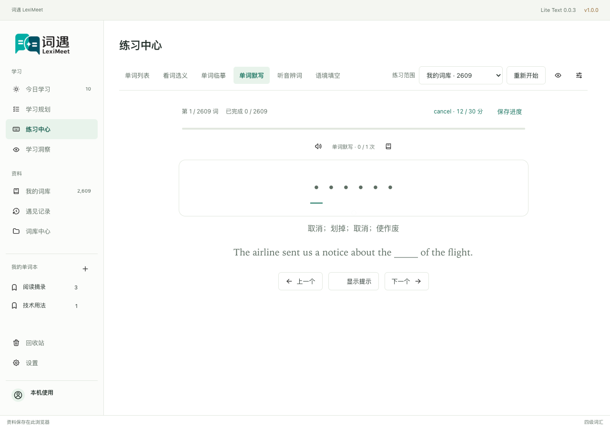</a>

### 听音辨词：听完后输入整词

点击“再听一次”，在答案框输入听到的词，再按 Enter 或点击“确认答案”。首次独立正确 **+1**；需要提示时点击“显示提示”，仍可继续输入，辅助后的完成不加分。

<a href="assets/usage-practice-listening.png">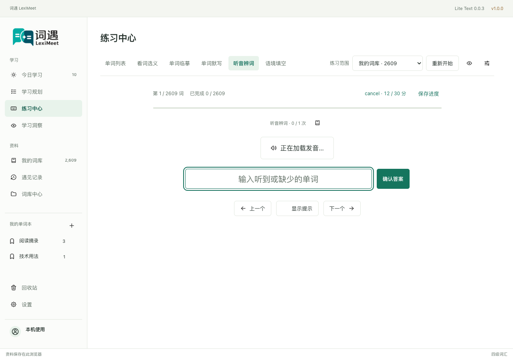</a>

<a href="assets/usage-listening-hint.png">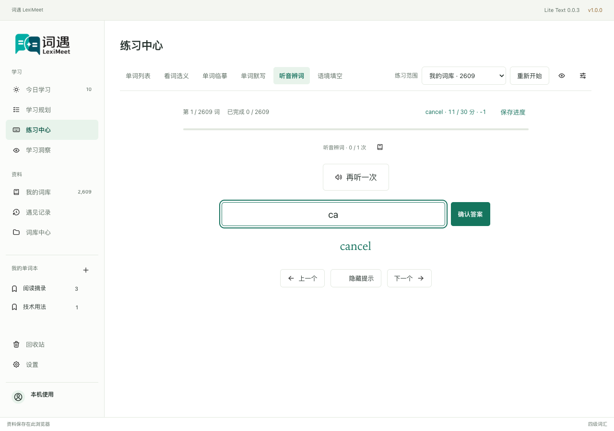</a>

演示测试用本地音频响应避免访问外部服务，画面不是音质或真实 Provider 可用性的证明。实际使用需要联网发音，失败时先检查网络和发音设置。

### 语境填空：从真实句子回忆单词

读例句，输入空缺的词，再按 Enter；首次独立正确 **+2**。没有真实例句时可换方式，不会生成虚构句子。

<a href="assets/usage-practice-cloze.png">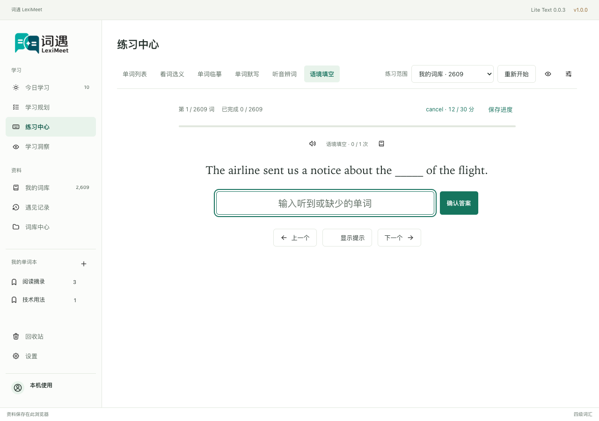</a>

“重新开始”建立新一轮并从第一词开始，已保存分数保留。保存失败时留在原题，使用“重试保存”；不要用重开代替确认保存。完整计分、状态和复习解释见[学习与复习](学习与复习.md)。

## 7. 连接桌面端后继续阅读

1. 启动桌面端，确认桌面端的插件连接服务和浏览器 Native Host 已就绪，见[连接指南](桌面连接.md)。
2. 在发现提示或连接页面发起连接，进入**浏览器真实确认窗口**接受邀请。
3. 双方显示连接成功后，回到文章，点击“分析本页”。侧栏顶部显示桌面工作区，底部显示已连接桌面端。
4. 在正文点词并采集，再到桌面端“遇见记录”核对新增句子。
5. 管理、规划和练习在桌面端完成；明确断开后，浏览器恢复原独立资料。

此图同样由同次无头会话的两个原始渲染表面并排展示。连接期间原浏览器资料封存；临时掉线只暂停，不会把采集悄悄改存浏览器，也不会自动合并两端资料。

下面是同一次连接演示中的桌面端“遇见记录”：两条不同的 `Node` 句子已保存，重复采集同句未新增记录。来源是本地示例文章。连接前准备的匹配词用于测试环境初始化，记录本身由浏览器实际采集写入。

## 8. 查看采集隐私设置

进入“设置”，找到“采集隐私与重复语境”：默认去重 **7 天**、敏感内容替换 `xxx`、单句上限 **500**。合法修改会自动保存；输入非法值时会提示尚未保存，修正后再确认。

<a href="assets/usage-capture-settings.png">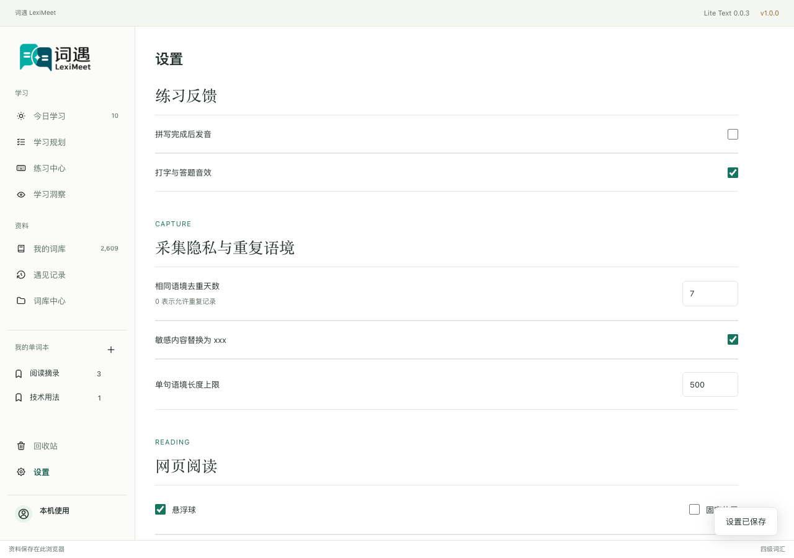</a>

这些设置影响后续采集，不能恢复已被替换的内容。连接桌面端时以桌面端政策为准，浏览器自己的偏好仍保留；规则脱敏识别不到的商业秘密和人名仍需自己检查。[隐私与权限](隐私与权限.md)

## 演示图的维护

复拍独立操作：`npm run test:browser -- tests/browser/user-guide.spec.ts`。复拍连接阅读：`npm run test:connected -- tests/connected/reading-ui.spec.ts --grep '真实连接遇见按词归并'`。先按[开发指南](开发指南.md)准备生产包和对应 Desktop/Core，然后串行执行；不要与其他真实 UI 套件同时运行。

输出保存在 `test-results/`，阅读图同时附正文原图、侧栏原图和像素尺寸/SHA 清单。原始报告和截图拆片在仓外保留；检查图片内容及主题后，再将当前展示图更新到 `docs/assets/`。日期、生成方式和 SHA 见[来源清单](assets/usage-sources.json)，当前明暗和窄窗界面见[UI与交互](UI与交互.md)，完整测试方法见[测试与验收](测试与验收.md)。
