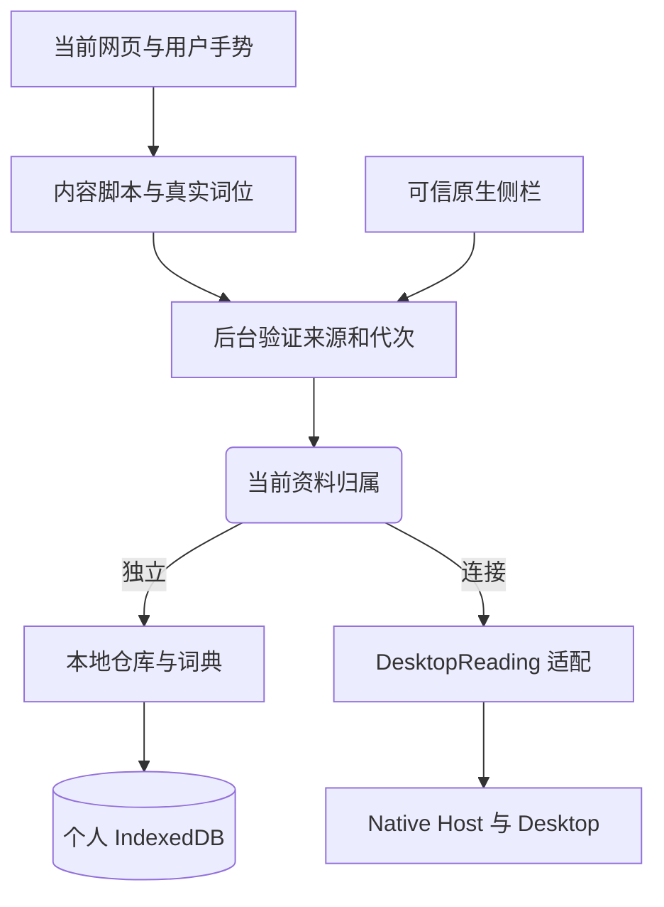
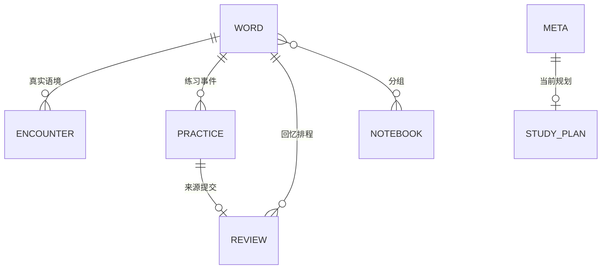
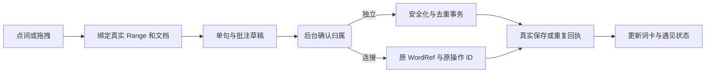

# 架构与数据

Browser 是一个运行在浏览器里的本地应用。独立模式拥有词库、学习规划和练习；连接模式把**网页阅读与采集**交给 Desktop。两种模式共享网页交互，但不会同时向两个词库写入。

本文按当前源码说明边界、数据关系和调用过程。学习数值见[学习与复习](学习与复习.md)，用户流程见[功能设计](功能设计.md)，协议字段以随包冻结合同为准。

## 运行表面与可信边界

WXT 构建 Manifest V3，Vue 渲染可信扩展页面，领域规则是普通 TypeScript 模块。网页、内容脚本、扩展页面和后台的权限不同：

| 表面       | 可以做什么                            | 不可以做什么                       | 入口                                   |
| ---------- | ------------------------------------- | ---------------------------------- | -------------------------------------- |
| 网页 DOM   | 提供当前正文、真实 Range 和用户手势   | 读个人数据库、Desktop 凭据         | 原网页                                 |
| 内容脚本   | 匹配词位、绘制高亮/词卡、收集采集草稿 | 直接落个人事实、信任网站发来的消息 | `entrypoints/page.content.ts`、`page/` |
| 原生侧栏   | 展示遇见、词卡、批注和采集回执        | 拿到长期配对凭据                   | `ui/StandalonePanel.vue`               |
| 独立管理页 | 词库、规划、练习、笔记和设置          | 代替连接模式继续写独立库           | `ui/StandaloneWorkspace.vue`           |
| 确认窗     | 接受或取消原连接邀请                  | 查私人词库、执行采集               | 固定的 `connection-confirmation.html`  |
| MV3 后台   | 验证消息、确定归属、调用仓库或 Native | 静默配对、伪造远端成功             | `entrypoints/background.ts`            |

<!-- leximeet-diagram: figure-05218d9d72-01 -->
<picture>
  <source media="(prefers-color-scheme: dark)" srcset="diagrams/rendered/figure-05218d9d72-01.dark.svg">
  
</picture>

查看和编辑 Mermaid 源码

[图源文件](diagrams/figure-05218d9d72-01.mmd)

<!-- /leximeet-diagram -->

后台不仅验证 `sender` 是本扩展，还按入口检查可信页面或当前 `tab/document/generation`。网站不能通过伪造同名消息调用私有操作。监听器保持异步消息通道并显式返回成功/错误；错误也不能把凭据或原生认证响应原样透给 UI。

内容脚本高亮使用 CSS Custom Highlight 和 Range。它不拆分 Text 节点、不把英文正文重新包成 span，不改变网站段落的布局。离开模式时只移除词遇自己的注册名、监听和界面。实际 DOM/段落几何回归见[测试与验收](测试与验收.md)。

## 组装方式：替换阅读后端，不代理整套管理页

当前有两个明确的组合点：

1. 独立应用由 `createApplicationServices` 组装 `PersonalLibraryRepository`、`LexiconProvider` 和无副作用的默认集成适配器。`LocalLibrary` 实现本地业务仓库；`LearningService` 生成题目，`LearningRepository` 判题和写事实。
2. 实际 Desktop 控制由 `DesktopConnection` 管理，网页业务由后台按归属选择本地操作或 `DesktopReading`。这不是把整个 `PersonalLibraryRepository` 换成远程 CRUD。

`ApplicationServices` 中的 `DesktopProvider` 是独立应用的可注入集成端口，不是当前 Native 连接状态的权威来源。实际管理页调用 `connection-state`：`WorkspaceRoot` 等待后台 `ownerReady` 为真，再挂载 `StandaloneWorkspace` 或 `ConnectedWorkspace`。连接管理页只提供前往 Desktop 和明确断开；不会在后台悄悄初始化原独立学习库。

| 稳定边界                    | 输入与输出                           | 当前实现                                                 |
| --------------------------- | ------------------------------------ | -------------------------------------------------------- |
| `PersonalLibraryRepository` | 添加/编辑/回收、语境、规划、学习事务 | `LocalLibrary`；方法集合定义在 `application-services.ts` |
| `LexiconProvider`           | 词头/词形匹配、词条、公共目录        | `CoreLexiconProvider`，只读固定词包                      |
| `LearningService`           | 范围、词身份、模式 → 冻结真实题      | `learning-service.ts`                                    |
| `LearningRepository`        | 题目 ID、答案、提交 ID → 权威回执    | `learning-repository.ts`                                 |
| `DesktopReading`            | WordRef 匹配、词卡、单词本、采集     | 严格 LMCP 客户端                                         |
| `DesktopConnection`         | 邀请、租约、恢复、断开、未知回执     | 私有控制存储和 Native 传输                               |

扩展功能时先判断它属于“独立管理”还是“网页阅读”。新增笔记编辑进入仓库事务；新增网页采集入口复用后台的归属判断和采集操作，不另写一套 Desktop 请求。

## 独立资料模型

个人库数据库名为 `leximeet-personal-v1`，当前 IndexedDB 版本为 4，应用格式为 `leximeet-browser-personal/4`。数据库版本是存储结构版本，应用格式用于拒绝不受支持的资料；两者不等于软件版本。

<!-- leximeet-diagram: figure-05218d9d72-02 -->
<picture>
  <source media="(prefers-color-scheme: dark)" srcset="diagrams/rendered/figure-05218d9d72-02.dark.svg">
  
</picture>

查看和编辑 Mermaid 源码

[图源文件](diagrams/figure-05218d9d72-02.mmd)

<!-- /leximeet-diagram -->

| Store        | 主键/索引                   | 保存的事实                                                                            |
| ------------ | --------------------------- | ------------------------------------------------------------------------------------- |
| `meta`       | 显式键                      | 词库/设备身份、设置、归属封存、规划、断点、顺序号、冻结题                             |
| `words`      | `id`；`normalized` 唯一索引 | 个人 UUID、公共 entryId 提示、词头、笔记、分组、revision、回收标记（编辑仅笔记/分组） |
| `encounters` | `id`；`wordId` 索引         | 单句、表面词、UTF-16 范围、来源、时区、批注、撤销标记                                 |
| `practice`   | `id`；`wordId` 索引         | 真实提交及学习事件、稳定题目 ID、顺序与规则版本                                       |
| `reviews`    | `id`；`wordId` 索引         | 有效独立回忆的 FSRS 事实和来源提交 ID                                                 |
| `notebooks`  | `id`                        | 名称、位置、颜色、revision 和回收标记                                                 |

六个 store 只保存当前模型。个人编辑仅允许 `note` 和 `notebookIds`；词典释义只读，状态、每日毕业和复习完成量从练习事件计算，不另存规划完成表。主题保存在本机设置，词卡与打字偏好保存在 `WorkspacePreferences`，学习额度保存在当前规划，避免同一设置有多个来源。

同一个人词可以有许多遇见和练习，但不能把一句重复捕获当成多个遇见，也不能把订正当成多个首次得分。列表状态、当前分数、今日完成量都从事实投影，不能由 UI 自行写“已掌握”。

上图是业务关系，不能直接当作 SQL 建表图：词与单词本的关联保存在 `words.notebookIds` 数组，规划和冻结题保存在 `meta` 的不同键。Browser 的 IndexedDB 与 Desktop 的 SQLite 是不同存储实现；同步所需的身份、事实和冲突语义必须先明确，不能通过照抄表名实现。

当前独立库按归一词头唯一；公共 `entryId` 是资源提示，个人 UUID 才是独立词实体 ID。该模型不能直接表示所有同形词多实体，也不同于 Desktop 的公共/自定义 `WordRef`。它足够支持当前独立学习和本地连接；2.0 云同步前仍须统一身份和事件模型，见[路线图](路线图.md)。连接时不能把独立 UUID 当成 Desktop 词身份。

## 一次练习怎样安全落盘

<!-- leximeet-diagram: figure-05218d9d72-03 -->
<picture>
  <source media="(prefers-color-scheme: dark)" srcset="diagrams/rendered/figure-05218d9d72-03.dark.svg">
  
</picture>

查看和编辑 Mermaid 源码

[图源文件](diagrams/figure-05218d9d72-03.mmd)

<!-- /leximeet-diagram -->

`LearningService.prepare` 由会话、词身份和模式生成题目 ID。已存在该 ID 时返回原题，因此切回一种练法不会临时改选项。选义用真实短义与筛选后的干扰项；填空必须有包含本词的真实句子。题目冻结词身份、大小写规则、选项和正确项或句子。

UI 提交答案/选项/列表反馈、辅助标记、时长和提交 ID。正确与否、分数和 FSRS 不是可从界面传入的权威字段。`LearningRepository` 在同一 IndexedDB 事务内检查归属、校验冻结题、记录作答、投影词状态、写关联回忆、分配顺序号。任一写入失败则整体回滚。

重复发送相同提交 ID 和内容时，返回原回执；同一 ID 换成不同内容时，则拒绝。保存失败保留原题和原提交 ID，可显式重试。若事务已成功、刷新回执失败，重试也不能再计一次分。练习草稿保存的是冻结队列、各模式游标/完成进度和逐词输入，不能再次把已保存的答题当作新成绩。

完成进度只按当前会话的完整回执计算，并按词和模式去重；展示草稿和游标不能撤销已完成的记录。规划面板读取目标投影、真实学习事件与当前到期时间；额度比较只创建内存投影，不触发写命令。

反馈和换题是两个步骤：保存确认后至少停留一秒；这一秒内词头、选项和选中状态都保持原题。若当前词发音仍在加载或播放，就等其结束；失败、用户停止与有界超时都释放等待。到时先准备下一题，再把词头、题目、游标一起提交到 Vue，避免旧选项被清空成“准备中”再出现。换方式、离开、重开或打开弹窗取消原计时，返回时不重建旧倒计时。提交回执也绑定操作时的界面代次：保存中离开再返回，迟到成功仍更新真实事实和分数，但不能重新创建已取消的自动切题。显式重试沿原事实 ID，并重新绑定当前界面意图。

## 一次网页采集的数据流

<!-- leximeet-diagram: figure-05218d9d72-04 -->
<picture>
  <source media="(prefers-color-scheme: dark)" srcset="diagrams/rendered/figure-05218d9d72-04.dark.svg">
  
</picture>

查看和编辑 Mermaid 源码

[图源文件](diagrams/figure-05218d9d72-04.mmd)

<!-- /leximeet-diagram -->

采集草稿保存原来源和具体词位，不用遇见概览行的分组键作为身份。安全处理先校验选词范围、识别并替换敏感片段，同时重新映射 UTF-16 位置，再截取命中词所在的句子并限制长度；落盘前再次确认范围仍指向表面词。收到采集回执后，才展示成功。

独立模式的词条物化和遇见在同一事务完成；默认七天内同词、同规范安全语境返回已有遇见。规范比较使用 NFC、空白归一和大小写归一；原句和真实范围不因此改写。不同句子和不同标点仍是不同语境。页面 `Node` 多处和 `The/the` 可以显示为一行，但每一个真实位置仍可单独选择。

连接模式由 Desktop 返回并确认权威 `WordRef`，原 `eventId/mutationId`、工作区和载荷先在私有控制库持久化。回执未知时查 `getOperation`，显式重试仍沿原 ID，不改投独立词库。服务端再做安全处理和去重，浏览器的预览不能绕过 Desktop 政策。

## 公共资源和私人资料隔离

词包和用户事实存放在不同的数据库。`dictionary-text.lock.json` 固定 Dictionary0.0.3 Lite/Core 文件、大小和 SHA。正文冷匹配读取词头/词形索引；打开词卡才读取和解压词条分片，不为一页高亮加载全量释义。

资源安装先放暂存区，逐文件验证后原子切换。取消、损坏或半包不会成为当前资源，也不能删除个人词条。Core 缺失时保留私人笔记和经历；可以按已保存词形临摹，但不会伪造缺失的选义题。

配对凭据和待回执写操作放后台私有控制库。租约投影缓存只用于当前授权阅读，不是私人事实的新来源。软刷新间隔不能延长绝对租约；修订号用十进制 BigInt 比较，修订号较低的旧快照不能覆盖刚采集后修订号较高的结果。

## 连接归属的硬边界

连接前，独立资料 A 会封存并停止写入；确认后使用 Desktop B。连接期间的采集 C 只写入 B；明确断开后恢复 A，B+C 保留。网络故障、Desktop 退出或撤权时，都不能自动回退到 A 写入。

封存和独立写入共享 `meta` 事务锁。即使旧管理页还在运行，`beginIndependentWrite` 也会在实际事务中拒绝写封存资料；不能只依赖按钮隐藏。归属切换撤下旧网页投影、清掉临时身份映射并取消旧异步请求，避免“旧词卡、新后端”的组合。

当前 Browser 未开放任意远程执行、远程练习工作区或云凭据转交。后续反向网页能力须逐能力声明和授权。[连接设计](桌面连接.md)

## 代码导航与改动检查

| 要改什么           | 先读哪些源码                                                       | 应补什么验证                                     |
| ------------------ | ------------------------------------------------------------------ | ------------------------------------------------ |
| 学习积分或到期资格 | `learning.ts`、`fsrs.ts`、`learning-workspace.ts`                  | 共享向量、自然日/衰减、真实学习事务              |
| 选义/拼写交互      | `practice-session.ts`、`LearningService`、`Practice.vue`           | 冻结题一致、快速操作、一秒完整换题、失败重试     |
| 采集入口或句子范围 | `page/document.ts`、`page/capture-intents.ts`、`capture-policy.ts` | Range/UTF-16、脱敏、七天去重、真实侧栏和连接落盘 |
| 个人字段或关系     | `local-database.ts`、`local-model.ts`                              | 事务原子性、revision 冲突、重启、资料保护        |
| Desktop 读取或调用 | `desktop-reading.ts`、`desktop-projection.ts`、`connector/`        | 权威 WordRef、租约/代次、未知回执、真实 Native   |
| 扩展权限或运行入口 | `entrypoints/`、`wxt.config.ts`                                    | 正式 manifest、来源隔离、公开/私人边界           |

纯模型、真实 IndexedDB、原样 MV3 UI、Native 源码联调和随包联调是不同验证层。共享向量能证明数值口径，不能替代真实连接，也不能证明云端数据模型已统一。测试启动和证据界限见[开发指南](开发指南.md)与[测试与验收](测试与验收.md)。

## 活动词表与批量整理

个人回收标记同时按公共 entryId 和归一词头排除目标投影，避免只读词书将回收词重新补成新词。明确恢复时，会将词条保留到我的词库并移除回收标记，不创建遇见或学习事件。练习断点会依据活动词表移除失效词，保留其余模式的位置和首次反馈身份。

`updatePersonalWords`在一个 IndexedDB 事务中校验选中词的版本、单词本有效性和资料归属，再执行笔记编辑、多本关联或批量回收；发生冲突时整批拒绝，不会部分成功。词性筛选只使用实际词包成员的主词性，不推断“重要等级”。云同步尚未实现，本轮没有改变 LMCP 19 方法或 Desktop 的管理边界。
