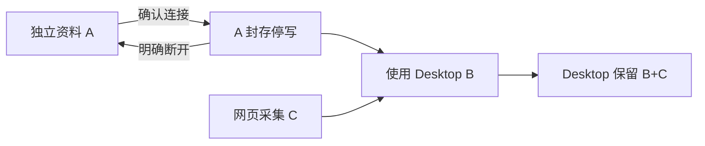
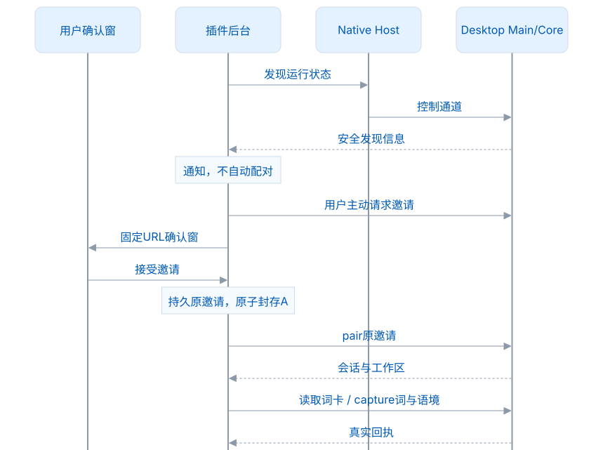
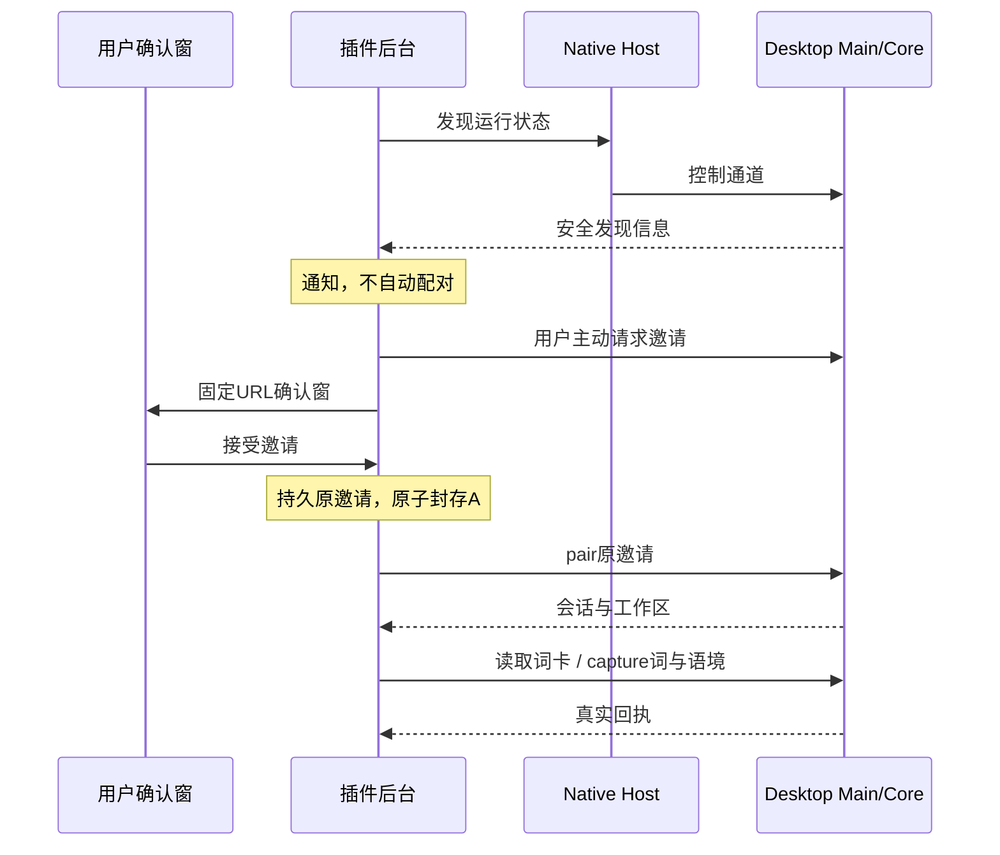

# Desktop 本地连接

连接会把浏览器的阅读后端换成 Desktop，不迁移独立词库，也不运行远程练习。Browser 负责网页位置与用户手势；Desktop 负责词身份、私人资料、授权和采集写入。固定合同见 `lib/connector/contracts/contract.json`，消费来源及文件摘要见 `snapshot.json`。

1.0.0 的私人内容只保留笔记：`getWord.personal` 是 `null` 或 `{note}`，采集的 `annotation` 是 `{note}`。公共释义和词性来自 Dictionary，私人标签及补充释义不进入采集请求；旧字段即使填空值也会被拒绝。修改快照须同时核对规范正文、Schema、方法及参考样例，使用 `npm run verify:connector`，再验证真实 Desktop/Core 连接。

构建快照始终精确核验；正式 1.x 运行连接时，按 API major、最低服务版本和必需能力与方法协商，新增可选能力或不同的交付摘要不会单独阻断连接。任一端为 rc 候选时，仍须使用相同合同版本与摘要。hello 信封与结果、后续响应的版本均绑定同一原生通道，原有的严格 Schema、授权和 WordRef 身份检查不变。[版本与兼容](版本与兼容.md)

## 用户与资料归属

启动 Desktop 后，插件每 30 秒探测已运行的通道；首次未就绪时，只在 1 秒后补探测一次。发现通道后可发送浏览器通知，用户从任一端发起连接后才打开浏览器确认窗。接受后，双方显示真实连接状态，不要求输入配对码。插件不会静默配对，也不会启动 Desktop。

<!-- leximeet-diagram: figure-aace3d9d75-01 -->
<picture>
  <source media="(prefers-color-scheme: dark)" srcset="diagrams/rendered/figure-aace3d9d75-01.dark.svg">
  
</picture>

查看和编辑 Mermaid 源码

[图源文件](diagrams/figure-aace3d9d75-01.mmd)

<!-- /leximeet-diagram -->

| 情况                      | 结果                                   |
| ------------------------- | -------------------------------------- |
| 取消/邀请过期且确定未接受 | 不切换资料                             |
| 配对回执不确定            | 保留原邀请、保持A封存，用原票查证      |
| 连接中管理/学习           | 提示前往Desktop；设置仅断开            |
| 临时掉线、应用退出        | 保持Desktop归属，暂停读写，不写回A     |
| 同一Desktop恢复           | 原凭据恢复原工作区，重新验证授权与租约 |
| 任一端可信明确断开        | 恢复A，桌面B+C不回滚                   |
| 撤权或另一Desktop出现     | 不解封A；等待插件明确断开              |

<!-- leximeet-diagram: figure-aace3d9d75-02 -->
<picture>
  <source media="(prefers-color-scheme: dark)" srcset="diagrams/rendered/figure-aace3d9d75-02.dark.svg">
  
</picture>

查看和编辑 Mermaid 源码

[图源文件](diagrams/figure-aace3d9d75-02.mmd)

<!-- /leximeet-diagram -->

## 读取和写入

Desktop 返回的 `WordRef`、公共 `entry_id` 或自定义 UUID 才是身份；拼写只用于显示和匹配。Browser 不能用独立词 ID 或 Lite 同名条目替代桌面身份；同一拼写匹配多项时，必须明确选择。资源缺失时如实显示，不伪造释义。

读取必须绑定 owner、workspace、generation 和私人读取租约。修订号用十进制 `BigInt` 比较，旧完整快照不能撤销刚采集后修订号更高的匹配结果；租约到期或授权变化时，撤下私人投影。切换归属时，清理旧网页候选与临时身份缓存。

采集时先持久化原 `eventId`、`mutationId`、工作区与载荷。回执未知时先查 `getOperation`，显式重试仍使用原身份；不得更换 ID 掩盖未知成功，也不得改投 A。同词位的浮球/侧栏/词卡请求能复用原意图；相同语境的另一事件可得到既有遇见ID，必须仍核对身份和安全范围。[安全与去重](隐私与权限.md)

邀请和长期配对凭据只保存在后台私有控制库，不进入网页、UI 公开状态、通知、URL 或 `storage.local`。确认窗只有邀请控制权限，不能读取个人历史或执行采集。

## 当前阅读接口怎样适配

网页负责“用户选了哪个位置”，Desktop负责“这个位置对应哪个词实体”。后台按当前归属调用 `DesktopReading`；内容脚本和侧栏不直接持有 Native 客户端。

| 浏览器动作     | 适配层操作                    | Desktop来源与检查                                                    |
| -------------- | ----------------------------- | -------------------------------------------------------------------- |
| 分析正文 token | `matches`                     | `matchWords`；结果完整、工作区与租约有效                             |
| 点词/悬停词卡  | `card`、`dictionary`          | 先匹配权威 WordRef，再 `getWord`；公共条目可用才 `getPublicEntry`    |
| 同拼写多个身份 | `select`                      | 用户选择必须属于本次完整匹配，不能默认第一条                         |
| 准备采集       | `prepareSelection`、`prepare` | 原公共身份，或明确未命中时自定义 UUID；不使用插件独立词 ID           |
| 单词本选择     | `notebooks`                   | 有可选能力才分页 `listNotebooks`；所有页 revision 一致，重复游标拒绝 |
| 采集安全预览   | `capturePolicy`               | 当前工作区的 Desktop 政策，写入前服务端仍再检查                      |
| 提交原草稿     | `DesktopConnection.capture`   | 原 event/mutation/工作区/载荷；回执身份和范围核验                    |

以上是插件内部方法，不是新协议定义。正式方法、参数、权限、字节预算和错误以 `lib/connector/contracts` 固定规范为准。增加插件便利接口不能暗中扩大 Desktop 授权。

例如，浏览器 Lite 只找到 `lead` 的一条本地词卡，Desktop 返回两个公共条目。连接模式必须让用户选 Desktop 的实际条目，然后以原 WordRef 查词和采集。本地资源级别或拼写相同都不能代替该选择。

## 读缓存和写回执的生命周期不同

读取票据绑定连接代次和工作区。每个异步返回在使用前再次核对：旧连接先发出的词卡即使后来成功，也不能覆盖已经切换的界面。`DesktopReading.remaining` 取实际租约绝对截止、请求开始后的刷新期限及30秒上限的最小值；负预算立即拒绝，不能钳成新的1ms租期。

私人投影的 revision 按十进制 BigInt 单调比较。例如采集后收到 revision 12，稍后到达的完整快照 revision 11 不能把新词从高亮列表撤销。资源临时不可用和部分索引不是权威“未命中”，不能当作新建词依据。

写操作则必须保留待回执身份，不能像读缓存一样过期删除：

| 保存情况           | 用户看到什么           | 后续行为                        |
| ------------------ | ---------------------- | ------------------------------- |
| 确认成功           | 真实保存/重复结果      | 更新投影和草稿状态              |
| 确认拒绝           | 明确原因，原资料未新增 | 按原因修改或取消原草稿          |
| 请求发出但响应断掉 | 待查证，不显示假成功   | 原操作查 `getOperation`，不换ID |
| 查询仍未知         | 保留原待回执           | 用户显式重试，仍为同操作        |
| 换归属或换工作区   | 暂停旧操作             | 不把旧草稿写入新的库            |

例：Desktop 已经保存一句 `Node uses the system.`，但响应在原生通道断开前丢失。浏览器不能重新生成 eventId 再发一次，也不能把它写进 A；恢复原工作区后查原操作，得到已有遇见回执，页面才确认成功。同位置的侧栏与浮球请求也不应各造一个意图。

## 如何扩展而不增加两份核心状态

1. 阅读展示新增字段，先通过 Desktop 的公开 DTO/租约取得，再投影给可信 UI；不直接传完整私人历史到网页。
2. 新采集入口只复用当前草稿、归属与 `capture`，不新增一套独立/连接保存逻辑。
3. 新管理功能优先跳转 Desktop；当前连接管理页不是整个远程 Workspace 的代理。
4. 新反向网页能力是可选插件能力，另行声明、授权和生命周期管理；不是允许 Desktop 任意执行网站脚本。

验证时至少覆盖独立、连接、请求在途时切换归属和临时失联，再运行真实 Native→Main→Core 和随包 Host/JRE 两条链。纯客户端消息样例无法证明实际软件之间已连通。

## 模块和范围

| 模块                    | 职责                                     |
| ----------------------- | ---------------------------------------- |
| `desktop-discovery.ts`  | 有界发现、通知去重与安全状态             |
| `desktop-connection.ts` | 邀请、封存、恢复、明确断开、未知采集回执 |
| `desktop-reading.ts`    | WordRef匹配、词卡、单词本、采集          |
| `desktop-projection.ts` | 租约、代次、单调修订                     |
| `local-ownership.ts`    | 独立写入事务内检查封存                   |
| `lib/connector/`        | 合同、严格参数/响应、Native传输          |

Desktop 的稳定 API 与各插件的可选反向能力分别管理。当前 Browser 未登记反向网页定位、选区或高亮能力；后续实现须按能力分别授权，不提供任意脚本执行。账号与 LMSP 属于 2.0.0，当前连接不复制云凭据或合并学习事件。

[隔离启动](开发指南.md#双端环境) · [真实测试](测试与验收.md)
