# 用户指南

词遇把阅读中遇到的单词和语境留在本机，再用六种练习逐步记住。可以只用浏览器，也可以连接桌面端，把浏览器作为阅读和采集入口。

本文截图来自**原样生产扩展的实际 UI 操作**，使用隔离浏览器和人工构造的阅读材料。图中的词和笔记是示例；连接、媒体播放和资料重启另有自动化检查，不用截图替代这些验证。

想跟着图片完成一次采集、记笔记、批量整理和六种练习，可以先看[实操演示](实操演示.md)。阅读工作区图由同次真实无头会话的正文和原生侧栏截图并排展示，不含浏览器工具栏；管理界面图直接截取完整管理页。

## 1. 安装并认识界面

1. 打开 [Chrome 插件](https://chromewebstore.google.com/detail/%E8%AF%8D%E9%81%87-leximeet/ffpencpinagmaiggednonfipgfmgmcdn) 或 [Edge 插件](https://microsoftedge.microsoft.com/addons/detail/%E8%AF%8D%E9%81%87leximeet/lokiongmifeccfecjjcmcdpihpohfmnc)，安装词遇 1.0.0。
2. 若要核对 [1.0.0 Release](https://github.com/leximeet/leximeet-browser/releases/tag/1.0.0) 中的 ZIP，或按[开发指南](开发指南.md)自行构建：在扩展管理页开启开发者模式，加载包含根 `manifest.json` 的目录。Chrome 源码目录是 `.output/chrome-mv3/`，Edge 源码目录是 `.output/edge-mv3/`。
3. 首次安装会打开使用教学，讲解固定工具栏图标，并带你打开真实侧栏。
4. 教学支持拖动、收起和跳过；设置→使用教学可重新开始，不会重置单词和笔记。

<a href="assets/usage-first-install.png">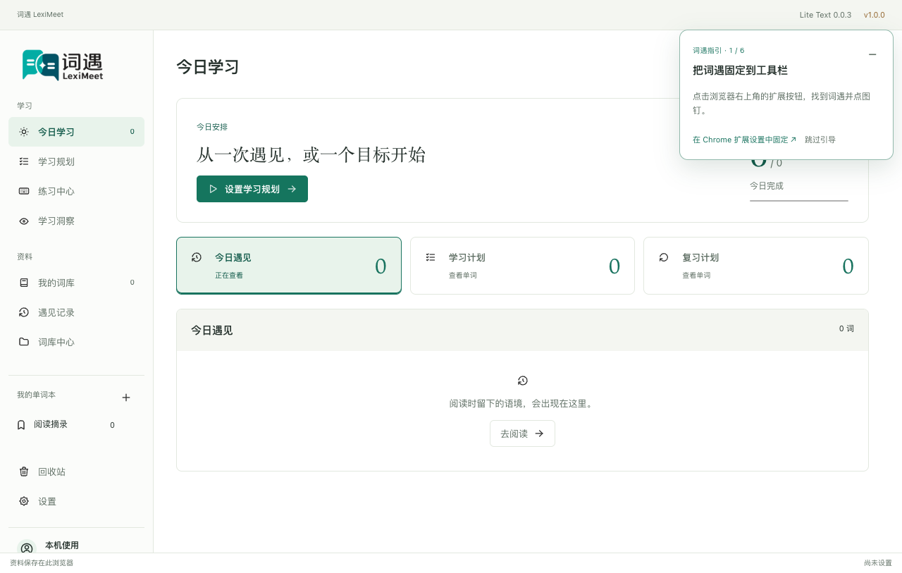</a>

需要 Chromium 142+。推荐从上面的商店页面安装。当前自动化只验证了 macOS 上的隔离 Chromium；正式浏览器上的系统通知、安装提示和其他操作系统仍需分别验收。

<!-- leximeet-diagram: figure-e58ce6468f-01 -->
<picture>
  <source media="(prefers-color-scheme: dark)" srcset="diagrams/rendered/figure-e58ce6468f-01.dark.svg">
  
</picture>

查看和编辑 Mermaid 源码

[图源文件](diagrams/figure-e58ce6468f-01.mmd)

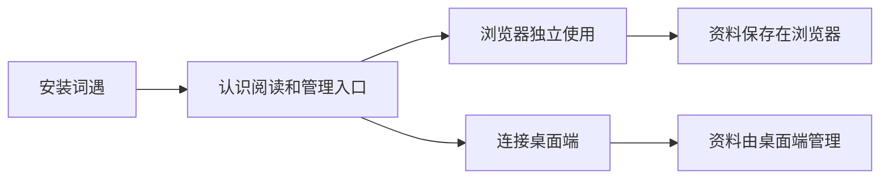

<!-- /leximeet-diagram -->

## 2. 选择自己的学习方式

不设学习规划也可以使用：手动加词、记录阅读语境、整理单词本，再自由练习。

需要固定节奏时，打开“学习规划”，先选学习目标，再设置每天的新学和复习量。目标可以是考试/专业词书，也可以是当前整本词典。

<a href="assets/usage-goal.png">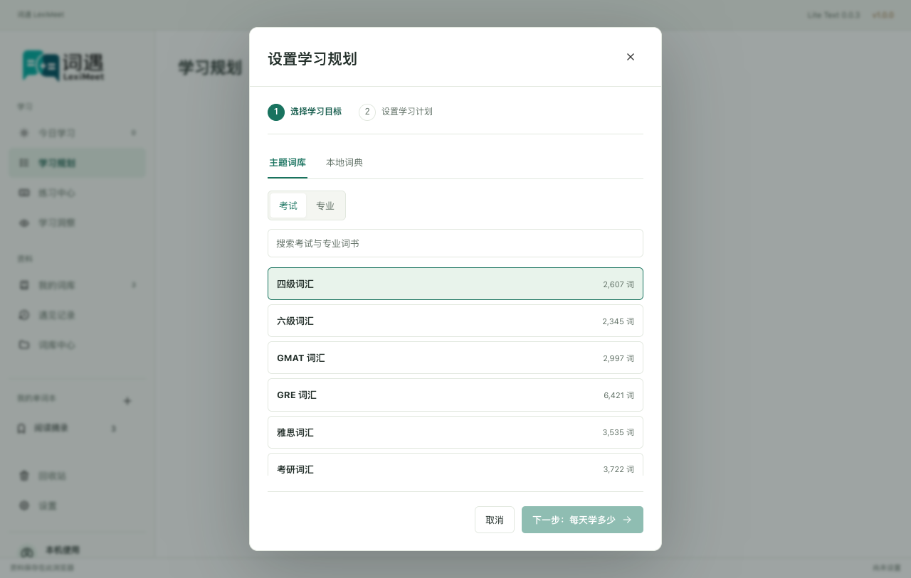</a>

默认新学 **10**、复习 **20**。先查看预计安排，点击“保存学习规划”后目标和计划一起生效。浏览器独立模式没有系统学习提醒；连接后由桌面端设置提醒。

<a href="assets/usage-plan.png">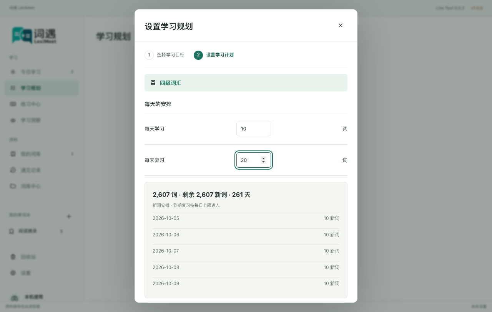</a>

“调整计划”修改每天的数量，保持原目标；“更换学习目标”替换当前规划，保留已有单词、笔记和学习记录。暂停计划只停止引入新的目标词，已经开始的学习仍可继续。

<!-- leximeet-diagram: figure-e58ce6468f-02 -->
<picture>
  <source media="(prefers-color-scheme: dark)" srcset="diagrams/rendered/figure-e58ce6468f-02.dark.svg">
  
</picture>

查看和编辑 Mermaid 源码

[图源文件](diagrams/figure-e58ce6468f-02.mmd)

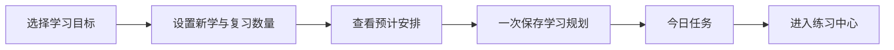

<!-- /leximeet-diagram -->

## 3. 在网页遇见单词

| 入口                     | 操作                                           |
| ------------------------ | ---------------------------------------------- |
| 工具栏 / `Alt+Shift+L`   | 打开当前窗口的原生侧栏，不自动扫描正文         |
| 悬浮球单击               | 开启遇见高亮，再点一次关闭                     |
| 侧栏“分析本页”           | 分析当前已经加载的正文，显示目标词和已有个人词 |
| 悬浮球右键 / `Shift+F10` | 打开或收起侧栏；侧栏打开时球仍保留             |
| 悬停高亮词               | 立即显示词卡；词头右侧的图标可以发音           |

遇见列表**一个词一行**：正文中三个 `Node` 不会变成三行，`The` 和 `the` 也会归为同一词。网页上的多个位置仍保留，悬停另一处会读取那一处的语境。

<a href="assets/usage-reading-workspace-light.png">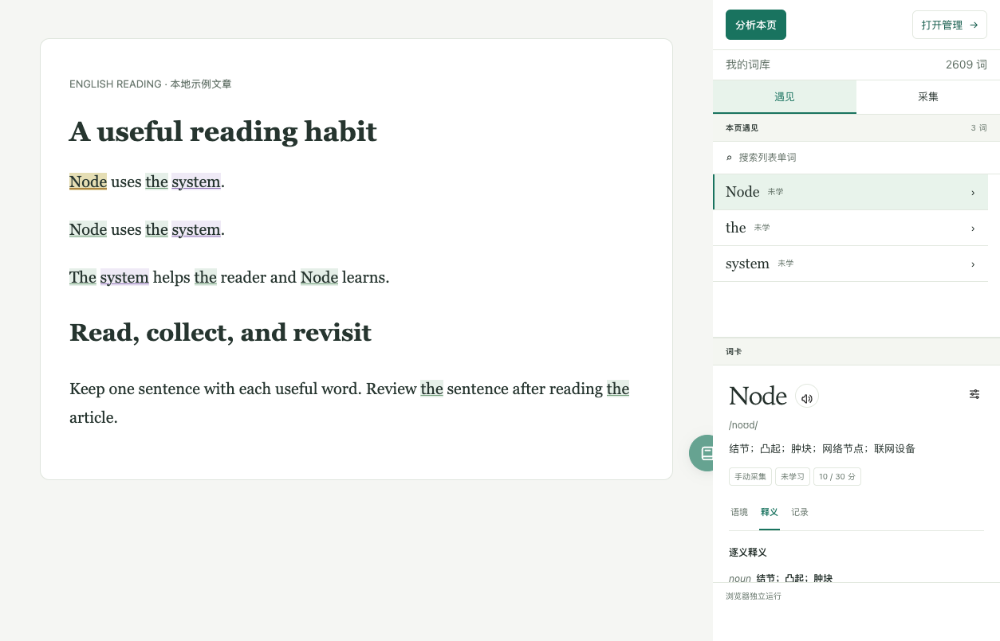</a>

分析或查看词卡不会自动保存遇见。只有明确采集成功，才会增加个人语境。网页私人历史只在可信扩展界面显示，不把笔记注入普通网页。

## 4. 采集一个词和它所在的句子

可以从这些入口采集。

- **悬浮球拖进正文**：蓝框圈住一个词，松手采集到默认单词本；空白或 Esc 取消。
- **高亮词卡“采集”**：保存正在查看的词及其实际语境。
- **侧栏“采集”**：点击正文中的词形成草稿，选好单词本后点击“加入单词本”。这一步只查所选词，不扫描整页。

<a href="assets/usage-capture-workspace.png">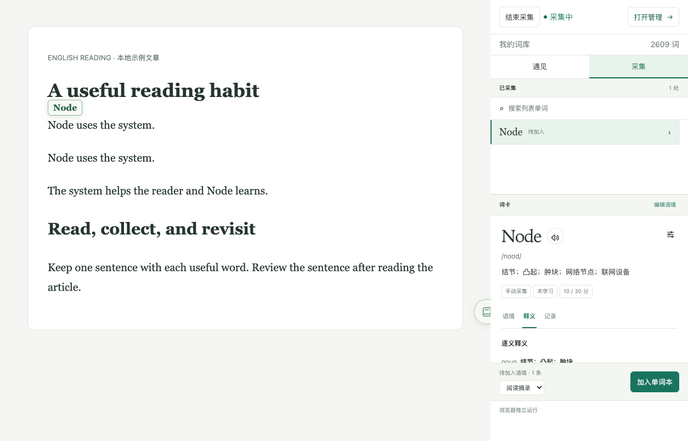</a>

默认规则：只保留命中词所在句子，最多 **500 个 UTF-16 单位**；可识别的敏感值替换为 `xxx`；**七天内同词同语境不重复保存**。比较时忽略大小写和多余空白，显示的原句和选词位置不变。不同句子仍各保留一条遇见。

例如：

| 采集内容                                       | 结果                   |
| ---------------------------------------------- | ---------------------- |
| 第一次 `Node uses the system.`                 | 保存一次遇见           |
| 七天内再次采集同句，或 `node uses THE system.` | 提示重复，不增加遇见   |
| `Node helps the reader.`                       | 是另一条语境，可以保存 |

<!-- leximeet-diagram: figure-e58ce6468f-03 -->
<picture>
  <source media="(prefers-color-scheme: dark)" srcset="diagrams/rendered/figure-e58ce6468f-03.dark.svg">
  
</picture>

查看和编辑 Mermaid 源码

[图源文件](diagrams/figure-e58ce6468f-03.mmd)

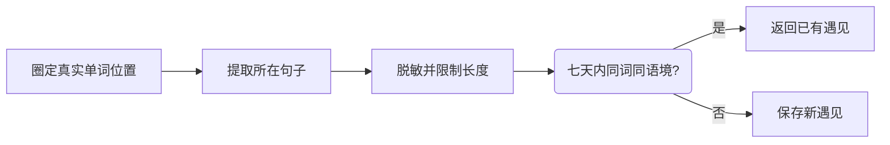

<!-- /leximeet-diagram -->

重复检查跨采集入口和来源使用同一规则。浏览器独立时在本地检查；连接时以桌面端政策和保存回执为准。重复不会额外增加通知。未命中、保存失败和连接中断都有提示，不把草稿显示当成已经保存。

离开采集前有未保存语境时，可以继续、丢弃或保留草稿。Chrome 原生关闭侧栏无法拦截，但会释放网页交互并保留草稿；刷新或导航后旧位置失效，不会误存到新页面。[隐私与权限](隐私与权限.md)

## 5. 整理词库和笔记

“我的词库”支持搜索单词、释义和笔记，也可按全部、未学习、学习中、待复习、已熟悉、不熟悉筛选。点击一个词，可以查看公共释义、真实语境和学习记录；“编辑个人内容”只保存我的笔记和多个单词本，释义来自公共词典。在最近更新旁，可筛选主词性和资料来源。列表默认没有勾选框。点击加号旁的铅笔按钮进入批量编辑，勾选后可加入多个单词本或移到回收站；翻页时保留选择，更换筛选或结束编辑时会清除选择。

<a href="assets/usage-library.png">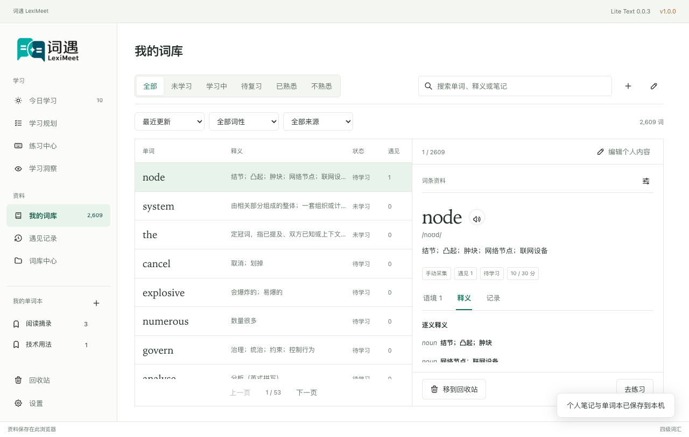</a>

同一词可以放入多个单词本。回收前需要确认；回收后，该词会同时退出活动词表、今日候选和练习草稿。回收站可以恢复误删的词，恢复后重新显示，学习历史保留。查词后明确重新加入也会恢复原词条；重复语境采集仍按去重处理，不自动恢复回收词。遇见记录可以按日期筛选，不同语境单独展示；语境文字小于词头，并保留完整句子。

## 6. 连贯地练习

练习中心选择“今日学习”“当前学习目标”“我的词库”或某个单词本。六种方式各自保存当前词位置、完成进度和草稿，换方式后可以从各自原位置继续；“重新开始”从第一词创建新一轮，保留已经记录的分数。

<a href="assets/choice-after-light.png">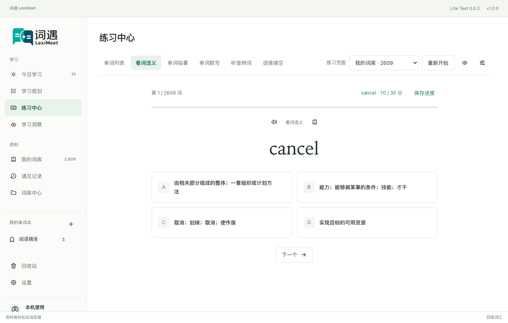</a>

| 方式     | 怎么用                                                            | 首次独立正确 |
| -------- | ----------------------------------------------------------------- | ------------ |
| 单词列表 | 默认遮住中文，先回想，再选“熟悉”或“不熟悉”                        | +1           |
| 看词选义 | 点击对应释义；正确反馈停留 **1 秒**后自动到下一个词；错误留在原词 | +1           |
| 单词临摹 | 看着淡色提示，在本练习的输入框逐字输入                            | +1           |
| 单词默写 | 回忆拼写并逐字输入                                                | +2           |
| 听音辨词 | 听发音，完整输入后按 Enter                                        | +1           |
| 语境填空 | 阅读真实例句，输入缺少的词后按 Enter                              | +2           |

<a href="assets/usage-copy-light.png">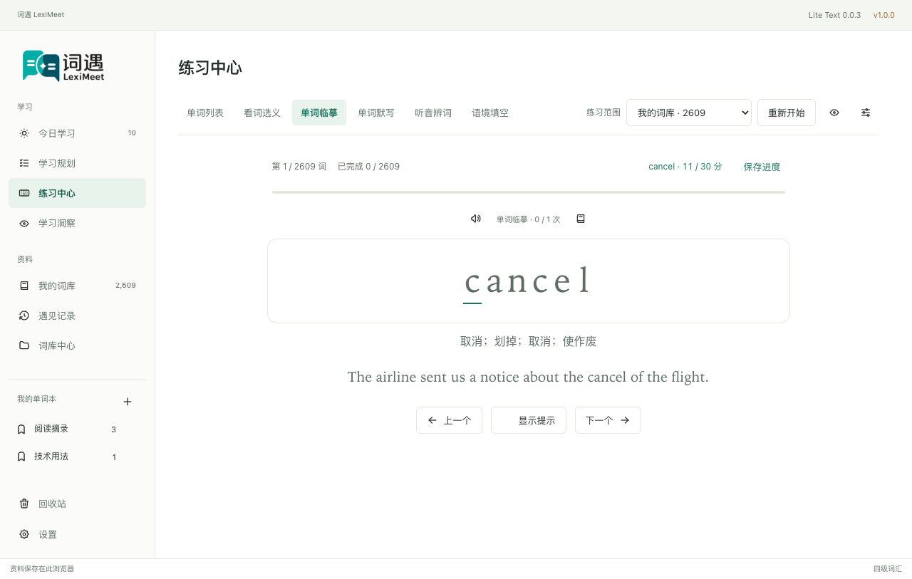</a>

错答或查看答案 **−1**，最低 0 分；已辅助后的完成和同题订正不重复加分。完成最后一遍拼写后才播放词音，完成反馈至少停留一秒。当前词正在发音时，会先完整播放；失败或超时后可以继续。拼写设置可以关闭自动下一词、调整重复次数和音效。选择题正确后的自动推进不受拼写设置影响。

分数初始 **10**，达到 **20** 完成初学；实际达到 **30** 进入休息。词库状态与经历一起计算，不能只看分数猜状态。主动练习影响熟悉度，FSRS 计算自动复习的到期建议；提前主动答对不会把尚未到期的提醒延后。[完整学习规则](学习与复习.md)

答案保存成功后，可点击练习区域的空白处进入下一个词；“上一个”用于回看原题，不重复加分。每种练法按已确认完成的词数显示进度，完成最后一个词后达到 100%。列表“熟悉 +1”“不熟悉 −1”直接标明分值。

保存中会禁用会冲突的操作。若提示“本题尚未保存”，点击“重试保存”，沿同一提交继续；不要靠重新开始抹掉未确认结果。离开页面、换模式、打开弹窗或重新开始会停止旧题倒计时。

## 7. 主题、词典和发音

设置支持明亮、深色和跟随系统。词卡可选择阅读密度和显示字段；窄窗仍保持练习控件可用。

<a href="assets/usage-copy-narrow-dark.png">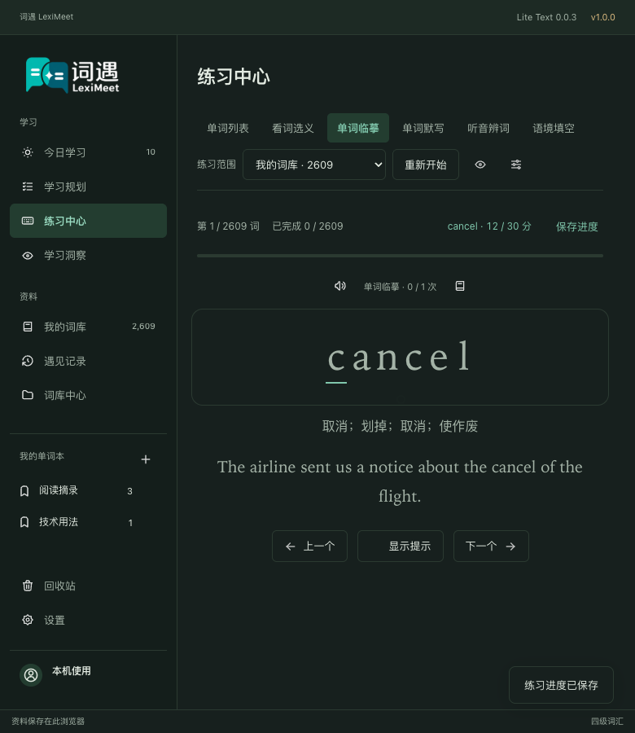</a>

内置 Dictionary 0.0.3 Lite Text：26,417 词、23 个主题词书。可安装 Core Text 增量：91,485 词，完成后合计 117,902 词；也可以切回 Lite，个人资料保留。浏览器不安装 Full，不打包录音。

默认使用有道在线英/美词头发音，也可配置无凭据的公开 HTTPS `{word}` 音频模板。只发送词头；微软 Provider 当前不可用。网络或播放失败可以重试，不承诺外部服务永久免费或始终可用。

## 8. 连接桌面端后怎么使用

启动 Desktop 后，发现通知会提示连接。从任一端发起，在浏览器独立确认窗接受后切换，两端显示连接成功。

<!-- leximeet-diagram: figure-e58ce6468f-04 -->
<picture>
  <source media="(prefers-color-scheme: dark)" srcset="diagrams/rendered/figure-e58ce6468f-04.dark.svg">
  
</picture>

查看和编辑 Mermaid 源码

[图源文件](diagrams/figure-e58ce6468f-04.mmd)

<!-- /leximeet-diagram -->

连接期间：

- 网页侧栏、悬浮球和词卡继续提供遇见、查询和采集。
- 管理与学习入口提示前往 Desktop；浏览器不运行第二套学习状态。
- 设置只提供断开。采集使用 Desktop 的单词身份、隐私政策和确认回执。
- 临时掉线只暂停，原资料继续封存；不会悄悄改存浏览器。明确断开才恢复原独立资料。

下面的阅读工作区图来自真实 Native Host→Desktop→Core 连接：正文和原生侧栏并排展示，连接状态明确显示在顶部和底部，Node 出现多处时仍只占一行，The/the 也归为同一词；同句不重复保存，不同句保留各自遇见。

<a href="assets/usage-connected-workspace.png">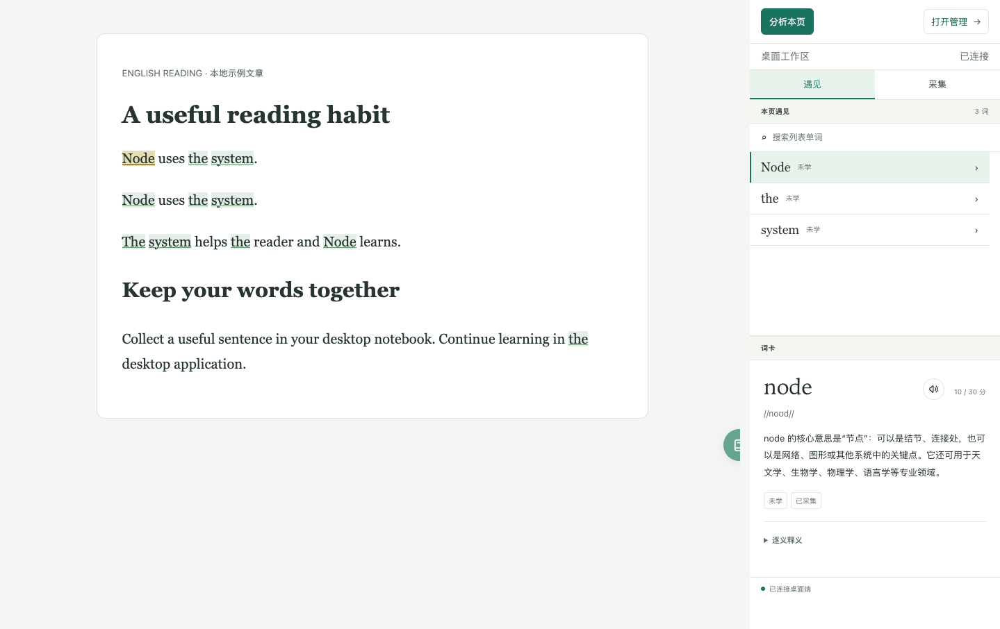</a>

连接不合并两端资料，也不表示已经登录云端。账号、云同步、个人资料导入导出均未提供。[连接步骤与异常处理](桌面连接.md)

## 设置与预测面板

合法设置自动保存；非法或空数值保留草稿并提示未保存，修正后再保存。每次保存成功都会重新显示提示动画；页尾的“保存设置”可再次确认保存。词卡选择“完整”或“自定义”立即打开字段确认；完整默认全选，调整字段转为自定义。取消保留原设置，点击“保存词卡设置”后生效。取消“我的阅读语境”会隐藏语境标签及正文，当前语境页回到释义；重新开启字段可以查看原语境，不会删除记录。“完整”以可阅读的形式显示释义、用法、例句与词汇关系，不展示原始 JSON。网站授权支持查找与分页。

学习规划面板回答四个问题：目标里的词目前是什么状态、最近有没有真正练习、接下来哪些天已有复习安排、不同每日新学量会怎样影响完成日期。

- 目标状态分布和初学完成率来自当前活动目标；一轮作答完成不等于该词已完成初学。
- 最近14天显示实际作答过的词，同词同日去重；只查看答案不算作答。
- 未来7天只显示当前已有到期排程，逾期归今天；不预测以后新产生的复习。超过每日额度用颜色提示，后续练习会改变排程。
- 点击每日额度方案比较预计完成日和候选顺序，只做预览；需要点击“调整计划”并保存才会修改实际计划。漏学、反复巩固和暂停都会延后完成。

练习进度按当前方式已保存的完成词数计算，旁边显示“已完成几词”。十词全部作答后显示 10/10；看词选义答错仍算完成本题，并正常扣分。仅到第十词、还有未作答的词时，进度不会显示满格，可以点击“补练未完成”。

<a href="assets/planning-dashboard-light.png">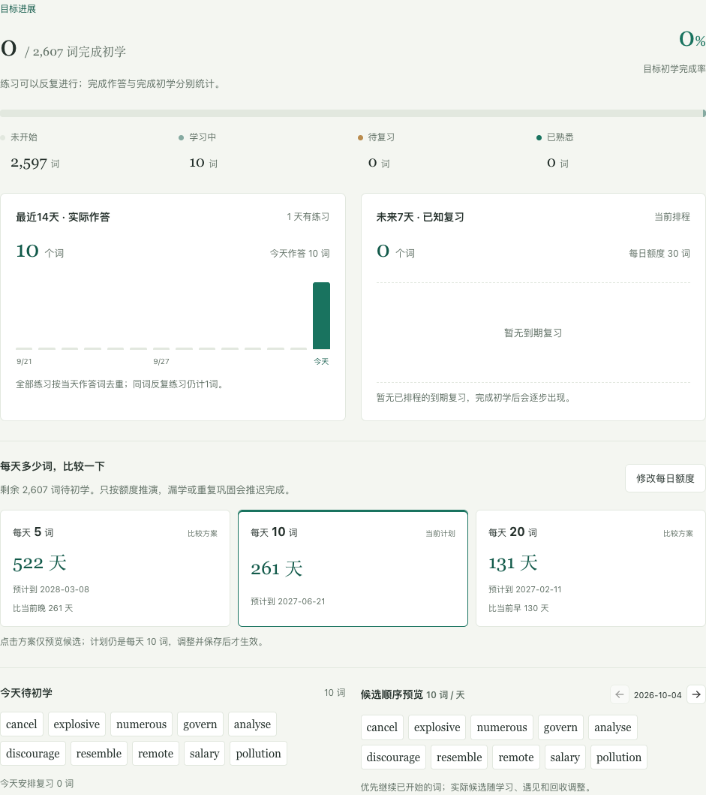</a>
