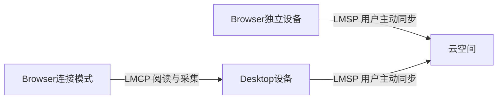

# 路线图与剩余任务

## 1.0.0已实现

已实现独立词典和完整学习流程，包含六种练习及可恢复的范围草稿。网页阅读支持遇见、三个采集入口和真实原生侧栏，采集采用当前单句脱敏和七天去重规则；教学及明暗窄窗也已实现。连接支持用户确认、A 封存停写、Desktop 权威读写、未知回执恢复和可信的明确断开。测试方法与层级见[验收门禁](验收基线.md)；具体发行物的实际通过结果与未验证范围以配套来源清单为准。

## 发行阶段待办

| 任务                      | 完成条件                                                                       |
| ------------------------- | ------------------------------------------------------------------------------ |
| 正式Chrome/Edge与平台矩阵 | 实际安装、来源授权、Native注册/卸载、重启/升级、通知；macOS结果不外推Win/Linux |
| 商店/Release与扩展身份    | 维护者明确渠道、固定正式扩展ID，验证签名/权限/下载SHA；不自动提交              |
| 远端CI证据                | 四仓同候选ref执行独立及连接工作流，保存真实run URL                             |
| 历史敏感信息处理          | 先审扫描与数量，再由维护者决定压缩/清理历史                                    |

## 1.x可选增强

- 复杂SPA、BFCache、Shadow DOM、iframe、编辑器、缩放和辅助技术矩阵；保持正文不变、无遗留交互锁。当前不增加all_frames来绕过边界。
- 原生侧栏收放的阅读锚点：分别验收窗口与嵌套滚动容器，保持当前词/段落的阅读位置；用户主动滚动后停止自动校正，避免与用户争夺阅读位置。当前已有卡片视口夹紧，尚不宣称完整锚点恢复。
- 看词选义人工质量抽审：覆盖多义词、同形词和相近干扰项，检查多个选项是否都合理、是否需给出语境/词性、干扰项是否过于相似。当前字符串去重及词性排序只是题目生成筛查，不能证明语义无歧义；发现歧义时先修订词典或不出该题。
- 大词库性能按真实生产链测冷/暖匹配、取消响应、Worker堆和整进程RSS；新证据须绑定新协议/源码，旧50k试验不是当前发布证明。
- 连接词卡查询优化：同身份、授权范围和修订的并发请求合并，消费者独立取消；缓存同时限制条数与字节，不能用软TTL延长私人读取租约。只有完整有效索引的明确未命中才可负缓存，断线、部分索引和缺资源不能当“未收录”。布局变化重算Range，不重复查词卡；读缓存淘汰不能删除采集待回执。新预算须实测，批量读取/物理取消能力按正式合同另行协商。
- 学习洞察扩展：先明确指标版本，再按练法、时间及来源聚合；长期保持率、有效练习用时、未来负担和语境覆盖率不能由答题次数推算。若接入翻译，逻辑需求与外部物理请求分开计数，缓存和重试不虚增用户需求；不默认保存请求正文或凭据，也不把发音请求算翻译调用。
- 微软发音适配：真实协议、权限、生命周期、失败与人工听感通过后才开放；不把兼容URL称官方免费API。
- 可选反向网页能力：由插件声明自己的定位/选区/高亮能力，Desktop按权限调用；不得提供任意脚本执行或默认全页读取。

## 2.0.0：独立设备登录与云同步

<!-- leximeet-diagram: figure-960d46a5b9-01 -->
<picture>
  <source media="(prefers-color-scheme: dark)" srcset="diagrams/rendered/figure-960d46a5b9-01.dark.svg">
  
</picture>

查看和编辑 Mermaid 源码

[图源文件](diagrams/figure-960d46a5b9-01.mmd)

<!-- /leximeet-diagram -->

合并前需先统一身份和事件。Browser 独立库当前的 normalized 唯一索引限制了同形多条，正式编辑模型包含个人笔记与多本关联，学习题目和 attempt 身份也与 Desktop 的实现存在差异。两端需要共同的事件字段、设备顺序、规则版本和明确的冲突策略，以及独立的数值、事务和云端证据；仅让表和字段同名，不能防止重复或因果冲突。

登录与同步开关分离、用户主动同步；可按最近三天/七天等分时间批次上传。首次进入云空间提供“云端覆盖”或“与本地合并”，合并冲突优先云端；具体字段、删除/撤销、时间排序与归属需LMSP正式合同验证。公共词包版本不同不丢私人笔记和语境；上行事实保留并集，下行保留完整身份，当前设备按可解析资源展示，不能用集合交集直接删除未知词事实。

连接前停止插件的独立云任务，并退出独立登录；连接中仅由 Desktop 运行 LMSP，长期云凭据不复制到插件。断开并恢复原有独立资料后，同步仍暂停，由用户主动登录和启用。1.0 没有生产账号，不展示虚假的登录、登出或同步成功。

不恢复已取消的个人文件导入导出、旧伴侣CaptureBatch、远程练习Workspace、0.x资料迁移。历史原型的缓存/规则求交思想只能在当前租约、WordRef、授权和接口边界内重新验证。

个人内容后续的同步模型以笔记和多个单词本为中心，不新增用户释义或自定义标签的产品入口。2.0 开发前再与 LMSP 共同确认合同，不能由 Browser 单边变更当前冻结协议。主词性筛选已实现；重要等级需在 Dictionary 实际提供可靠字段后再接入。
